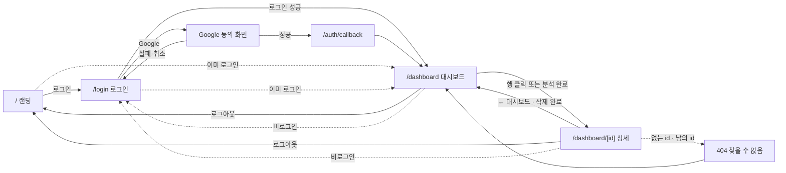
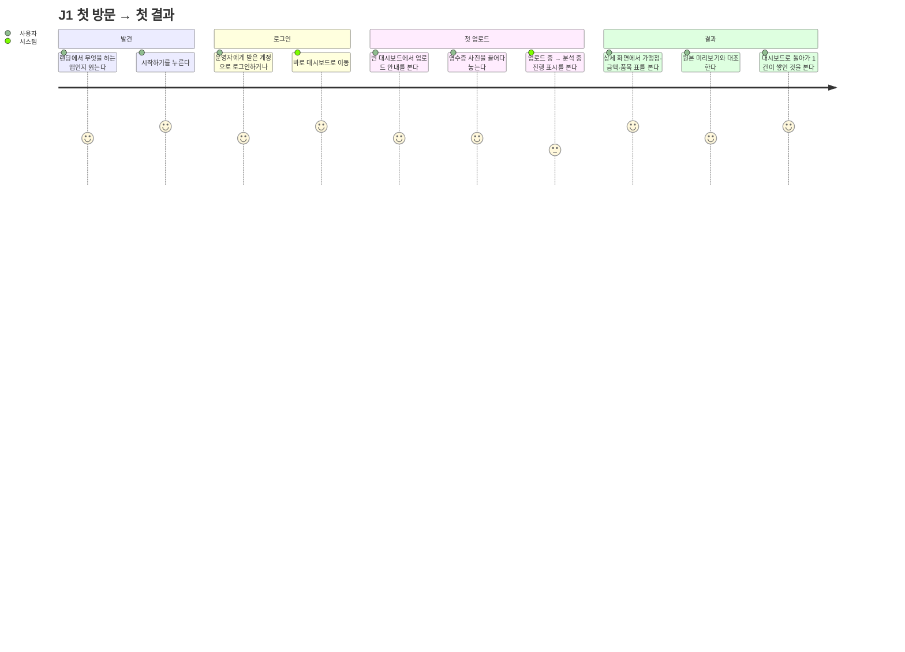
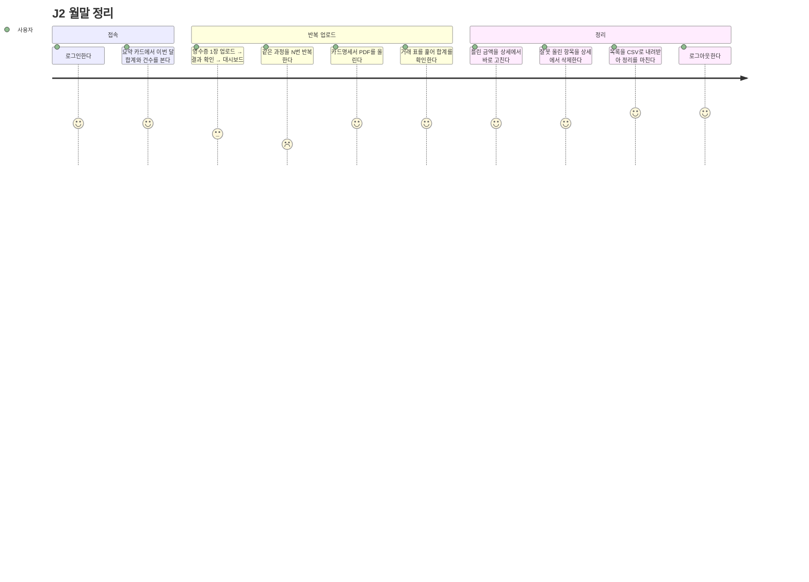
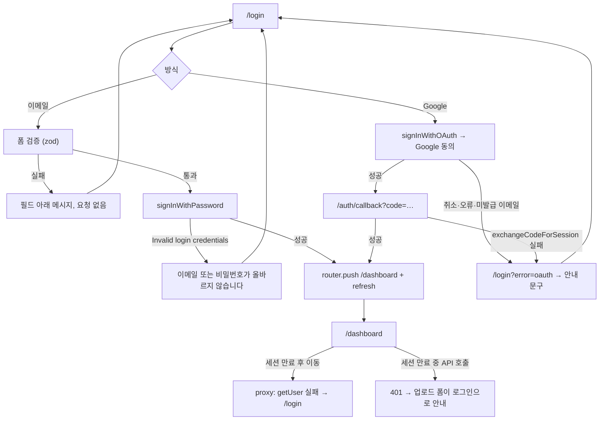
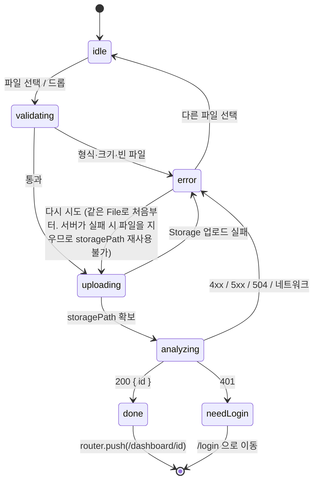
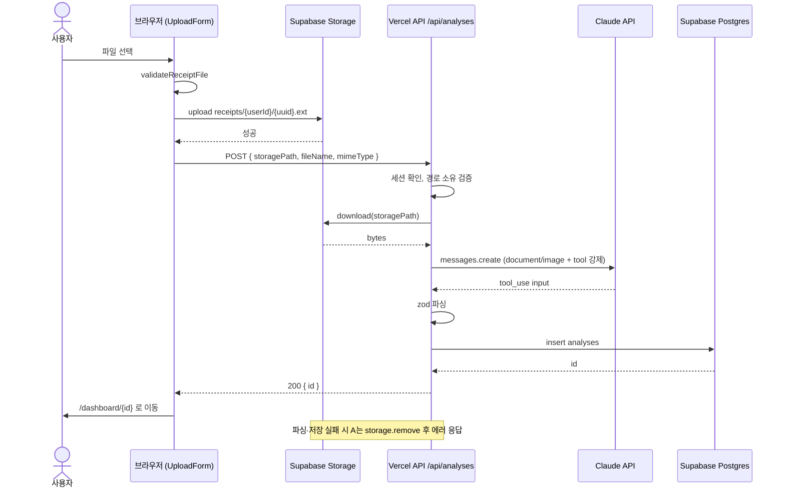
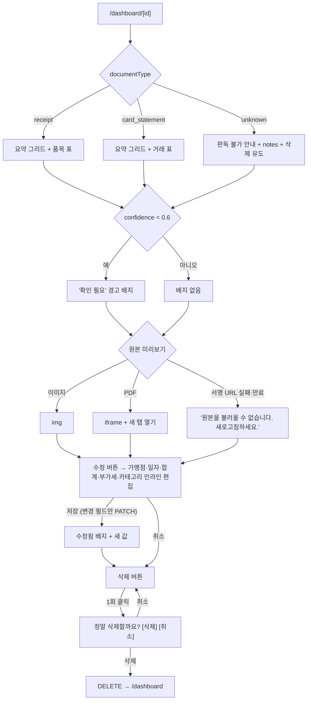
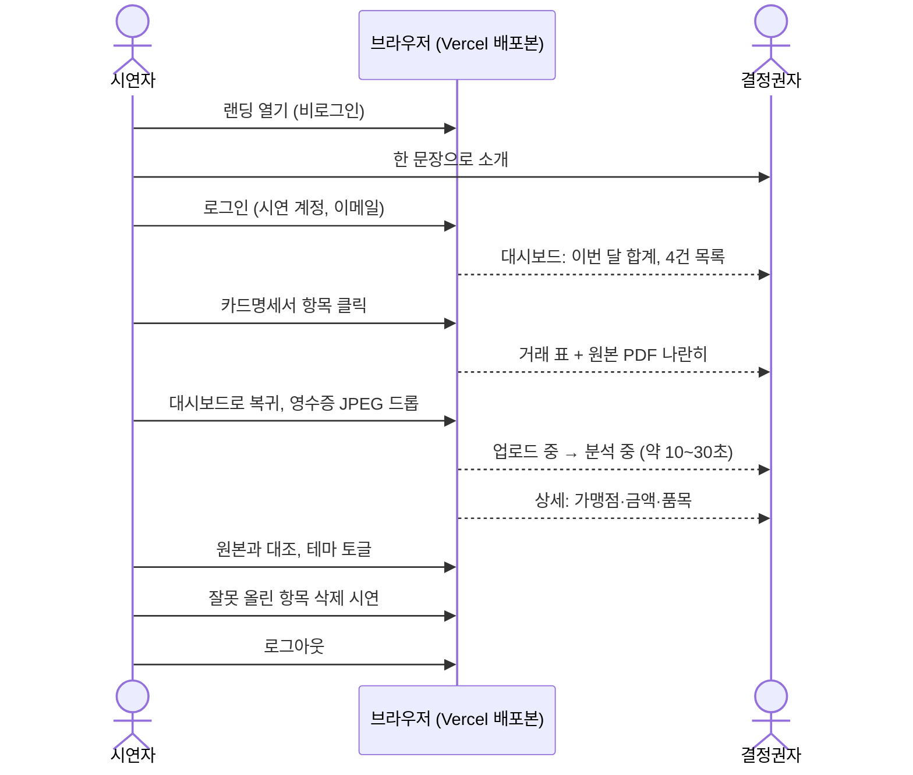

# 사용자 흐름과 사용 시나리오

이 문서는 "누가, 어떤 상황에서, 어떤 순서로" SlipScan을 쓰는지를 정의한다. 화면·상태·예외는 여기 정의를 따른다. 범위(무엇을 만들고 안 만드는지)는 `PRD.md`, 구조는 `ARCHITECTURE.md`가 기준이다.

## 1. 페르소나

| ID | 페르소나 | 상황 | 목표 | 성공 기준 |
|----|----------|------|------|-----------|
| P1 | 경리·총무 담당자 (주 사용자) | 월말에 직원이 낸 영수증 30~100장과 법인카드 명세서 PDF를 정리 | 수기 입력 없이 표로 만들고 누락·오류를 찾는다 | 장당 1분 미만, 합계 금액이 정확 |
| P2 | 1인 사업자·프리랜서 | 지출 즉시 휴대폰으로 영수증을 찍어 둔다 | 나중에 한 번에 정리할 수 있게 쌓아둔다 | 모바일에서 30초 안에 업로드 완료 |
| P3 | 결정권자 (시연 대상) | 도입 판단을 위해 시연을 본다 | 정확도와 속도를 눈으로 확인한다 | 라이브 업로드 1건이 1분 안에 표로 보인다 |
| P4 | 시연자 (운영자) | 시연 계정과 샘플 데이터를 준비한다 | 어느 기기에서든 같은 화면이 나온다 | 준비 30분 이내, 시연 중 오류 0 |

## 2. 가설과 검증 방법

| ID | 가설 | MVP에서 확인하는 방법 | 틀렸을 때의 대응 |
|----|------|----------------------|------------------|
| H1 | 업로드→표 확인이 수기 입력보다 빠르다고 느낀다 | 업로드부터 상세 화면까지 60초 이내 (`maxDuration` 60초) | 비동기 큐 도입 |
| H2 | 합계 금액이 맞으면 결과를 신뢰한다. 틀리면 직접 고치고 싶어 한다 | 수정 기능 사용 비율(`edited_at`이 있는 행) | 수정이 잦은 필드에 맞춰 프롬프트 보강 |
| H3 | 한 번에 여러 장을 올리고 싶어 한다 | 단일 파일 제한에 대한 불만 관찰 | 다중 업로드 추가 (현재 MVP 제외) |
| H4 | 결정권자는 "쌓인 대시보드"와 "라이브 분석" 두 가지로 가치를 판단한다 | 시연 시나리오(9절) 반응 | 시연 순서 조정 |
| H5 | 모바일 촬영 업로드 수요가 있다 | 모바일 접속·업로드 비율 | 카메라 직접 촬영 입력, 이미지 축소 추가 |
| H6 | 월말 정리의 최종 산출물은 표 파일이다 | CSV 내보내기 사용 비율, "거래 행 단위로 필요하다" 요청 | 거래 행 단위 내보내기, 월별 필터 추가 |
| H7 | 원본을 옆에 두고 대조하고 싶어 한다 | 상세 화면의 원본 미리보기 사용 빈도 | 미리보기 확대·페이지 이동 |
| H8 | 담당자 계정 하나로 회사 전체를 정리해도 MVP에서는 충분하다 | "직원별로 나누고 싶다" 요청 여부 | 조직·직원 개념 추가 |

## 3. 화면 지도와 이동

점선은 `proxy.ts`와 서버 컴포넌트가 자동으로 보내는 이동이다. 사용자가 누르는 것이 아니다.

## 4. 핵심 저니

### J1. 첫 방문에서 첫 결과까지 (P1, P2)

첫 결과까지 걸리는 시간이 이 앱의 "아하 모먼트"다. 프로필 입력, 비밀번호 변경 강제, 튜토리얼 같은 중간 단계를 두지 않는다. 계정은 운영자가 미리 발급한다(공개 가입 없음).

### J2. 월말 정리 (P1, 반복 사용)

"N번 반복" 구간의 만족도가 가장 낮다. H3(다중 업로드)의 근거이며, MVP에서는 업로드 폼을 대시보드 상단에 고정해 왕복을 최소화한다.

### J3. 이동 중 촬영 (P2, 모바일)

1. 휴대폰 브라우저에서 로그인 상태로 `/dashboard`에 접속한다.
2. 업로드 영역을 탭하면 iOS·Android가 "사진 찍기 / 앨범" 선택을 띄운다. iOS Safari는 파일 입력으로 올리는 HEIC를 JPEG로 자동 변환한다. HEIC 문제는 데스크톱에 AirDrop으로 옮긴 파일에서만 생긴다.
3. 분석이 끝나면 상세 화면. 표는 가로 스크롤 컨테이너 안에 있어 좁은 화면에서도 깨지지 않는다.

## 5. 인증 흐름

규칙:
- 로그인 상태에서 `/login`에 오면 `/dashboard`로 보낸다. 시연 중 뒤로가기로 로그인 화면이 다시 뜨는 일을 막는다.
- 공개 가입이 없다. 계정은 운영자가 Supabase 대시보드에서 발급하고, Google 로그인은 발급된 계정과 같은 이메일일 때만 성공한다. 미발급 이메일로 Google을 누르면 콜백이 실패해 `/login?error=oauth`로 돌아온다.
- 로그아웃은 항상 랜딩(`/`)으로 보낸다.

## 6. 업로드·분석 상태 머신

상태별 화면:

| 상태 | 사용자에게 보이는 것 | 입력 |
|------|---------------------|------|
| idle | 점선 업로드 영역, "PDF 20MB, 이미지(JPEG·PNG·WEBP) 5MB 이하" 안내 한 줄 | 클릭·드롭 가능 |
| validating | 즉시 판정 (화면 변화 없음) | - |
| uploading | 스피너 + "업로드 중…" | 잠김 |
| analyzing | 스피너 + "분석 중… 최대 1분 걸릴 수 있습니다." | 잠김 |
| error | 빨간 테두리 + 원인 문구 + "다시 시도" / "다른 파일 선택" | 파일 선택 가능 |
| needLogin | "세션이 만료되었습니다." + 로그인 링크 | - |

`analyzing` 중에 페이지를 떠나거나 새로고침해도 서버는 분석을 끝내고 저장한다. 사용자가 대시보드로 돌아오면 목록에 나타난다.

## 7. 업로드·분석 시퀀스

## 8. 상세 확인과 삭제

## 9. 시연 시나리오 (P3, P4)

사전 준비(P4): 시연 계정 생성, 영수증 3건과 카드명세서 1건을 미리 분석해 둠, 라이브 업로드용 영수증 JPEG 1장을 바탕화면에 준비, 시연 기기에서 Google 계정 로그아웃 상태 확인.

시연 중 피할 것: Google 로그인(동의 화면 변수), 5MB 넘는 사진, 20페이지 넘는 PDF, 실제 직원 데이터.

## 10. 유스케이스 목록

| ID | 유스케이스 | 사전 조건 | 정상 흐름 결과 | 예외 | 구현 step |
|----|-----------|-----------|----------------|------|-----------|
| UC-01 | 랜딩 조회 | 비로그인 | 소개·CTA 표시 | 로그인 상태면 대시보드로 | 10 |
| UC-02 | 운영자 계정 발급 | Supabase 대시보드 접근 | Users → Add user(Auto Confirm) 후 자격 전달 | 공개 가입은 차단됨 | 11 |
| UC-03 | 이메일 로그인 | 계정 존재 | 대시보드 | 자격 증명 오류 | 3 |
| UC-04 | Google 로그인 (발급된 계정) | Google provider 설정, 같은 이메일의 계정 존재 | 콜백 후 대시보드 | 취소, 미발급 이메일, 테스트 모드 제한 | 3 |
| UC-05 | 로그아웃 | 로그인 | 랜딩으로 | - | 3 |
| UC-06 | 비로그인 접근 | - | `/login`으로 | - | 2 |
| UC-07 | 파일 업로드 (클릭·드롭) | 로그인 | 분석 시작 | UC-08 | 7 |
| UC-08 | 파일 검증 실패 | - | 원인 문구, 요청 없음 | HEIC, GIF, 크기 초과, 빈 파일 | 7 |
| UC-09 | 분석 진행 대기 | 업로드 성공 | 단계별 문구·스피너 | 페이지 이탈 시 서버는 계속 진행 | 7 |
| UC-10 | 분석 성공 | - | 상세로 이동 | - | 5, 7 |
| UC-11 | 분석 실패 | - | 원인 문구, 재시도·다른 파일 | 422 형식 오류, 502 LLM 오류, 504 시간 초과, 401 세션 만료 | 5, 7 |
| UC-12 | 대시보드 조회 | 로그인 | 요약 카드 + 최근 100건 | - | 6 |
| UC-13 | 빈 대시보드 | 분석 0건 | 안내 문구 + 업로드 유도 | - | 6 |
| UC-14 | 영수증 상세 | 분석 존재 | 요약 + 품목 표 + 원본 | 저신뢰도 배지 | 6 |
| UC-15 | 카드명세서 상세 | 분석 존재 | 요약 + 거래 표 + 원본 | 거래 수 많음 → 표 스크롤 | 6 |
| UC-16 | 판독 불가 상세 | documentType unknown | 안내 + notes + 삭제 유도 | - | 6 |
| UC-17 | 원본 미리보기 | 서명 URL 발급 | 이미지·PDF 표시 | 5분 만료 → 새로고침 안내 | 6 |
| UC-18 | 삭제 | 본인 분석 | 확인 후 삭제, 대시보드 복귀 | API 실패 문구 | 7 |
| UC-19 | 테마 전환 | - | 즉시 반영, 기기별 기억 | - | 0 |
| UC-20 | 없는·남의 분석 URL | - | 404 화면 + 대시보드 링크 | - | 6 |
| UC-21 | 외화 영수증 | currency ≠ KRW | 금액에 통화 표기, 월 합계 제외 | - | 1, 6 |
| UC-22 | 같은 영수증 중복 업로드 | - | 별도 항목으로 저장 (중복 허용) | - | 5 |
| UC-23 | 시연 계정·샘플 준비 | Supabase 접근 | README 절차 | - | 11 |
| UC-24 | 모바일 촬영 업로드 | 모바일 브라우저 | 카메라·앨범 선택 → 동일 흐름 | 5MB 초과 사진 | 7 |
| UC-25 | 결과 수정 | 본인 분석 | 5개 필드 인라인 편집, 저장 후 "수정됨" 배지 | 검증 실패(음수·날짜 형식), 401 | 1, 2, 5, 8 |
| UC-26 | CSV 내보내기 | 분석 1건 이상 | 목록(최근 100건)을 CSV로 저장, Excel에서 한글 정상 | 0건이면 버튼 비활성 | 9 |

## 11. 예외·엣지 케이스

| 상황 | 사용자에게 보이는 것 | 시스템 동작 | 구현 step |
|------|---------------------|-------------|-----------|
| 업로드 성공 후 분석·저장 실패 | 원인 문구 + 다른 파일 선택 | API가 `storage.remove`로 파일 정리 | 5 |
| 분석 60초 초과 | "시간이 초과되었습니다. 페이지 수가 적은 파일로 다시 시도하세요." | Vercel 504, 본문이 JSON이 아님 → 폼이 상태 코드로 판단. Storage 파일이 남을 수 있다 (MVP 감수) | 7 |
| 세션 만료 중 업로드 | "세션이 만료되었습니다." + 로그인 링크 | 401. Storage 파일이 남을 수 있다 (MVP 감수) | 7 |
| 네트워크 끊김 | "네트워크 오류입니다. 다시 시도하세요." | fetch reject | 7 |
| 영수증이 아닌 사진 | 판독 불가 화면, notes에 사유 | `unknown`, `totalAmount 0` | 4, 6 |
| 한 사진에 영수증 여러 장 | 첫 번째만 인식, notes에 "여러 장 감지" | 프롬프트 규칙 | 4 |
| 스캔 품질 낮음 | 결과 + "확인 필요" 배지 | `confidence < 0.6` | 4, 6 |
| 이미지 PDF (스캔본) | 정상 처리 | Claude가 PDF 이미지를 읽음 | 4 |
| 암호 PDF, 100페이지 초과 PDF, 8000px 초과 이미지 | "이 파일은 분석할 수 없습니다. 암호가 걸렸거나 페이지 수·해상도가 너무 큽니다." (재시도 안내 없음) | Claude 4xx → `rejected_input` → 422 | 4, 5 |
| 다른 탭에서 삭제된 항목을 수정 | "이미 삭제된 항목입니다." → 대시보드로 | PATCH 404 고정 문구 | 5, 8 |
| 환불 영수증 | "-12,000원"으로 표시, 월 합계에서 차감 | 음수 허용 | 1, 6 |
| 서명 URL(5분) 만료 후 뒤로가기 | "원본을 불러올 수 없습니다. 새로고침하세요." | iframe/img 로드 실패 | 6 |
| 분석 중 새로고침 | 대시보드 목록에 결과가 나타남 | 서버는 응답과 무관하게 저장 완료 | 5 |
| Google 앱 테스트 모드 | Google 경고 화면 또는 거부 | 운영 설정 문제. README 안내 | 11 |
| 목록 100건 초과 | 최근 100건만 표시. 요약 카드도 그 100건 기준 | `listByUser` limit 100 (MVP 감수) | 2 |

## 12. 이 분석이 계획에 반영된 것

- step 2: `listByUser`는 최근 100건으로 제한한다.
- step 6: `confidence < 0.6` 경고 배지, `unknown` 안내 화면, 표의 가로 스크롤 컨테이너, 미리보기 실패 문구.
- step 7: 401·504·네트워크 오류를 구분해 표시하고 "다시 시도" 동작을 둔다. 업로드 영역에 허용 형식·크기 안내 문구를 둔다.
- step 4: 프롬프트에 "여러 장 감지", "영수증 아님" 규칙을 넣는다.
- step 8 (신규): 상세에서 가맹점·일자·합계·부가세·카테고리를 인라인 편집. J2의 "결과 확인" 단계에서 틀린 값을 그 자리에서 고친다 (H2).
- step 9 (신규): 대시보드 목록을 CSV로 내보내기. J2의 최종 산출물 (H6).
- 랜딩(step 10)은 J1의 첫 단계이므로 CTA 하나로 로그인에 직행한다. 기능 소개는 3개를 넘기지 않는다.

가설 H3(다중 업로드)와 재분석은 다음 phase 후보다. MVP 범위는 `PRD.md`를 따른다.
