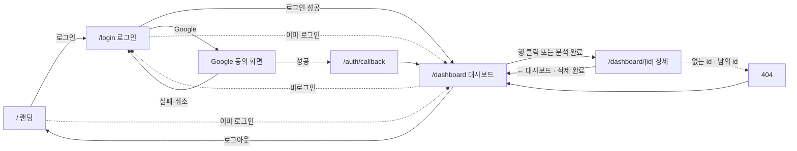
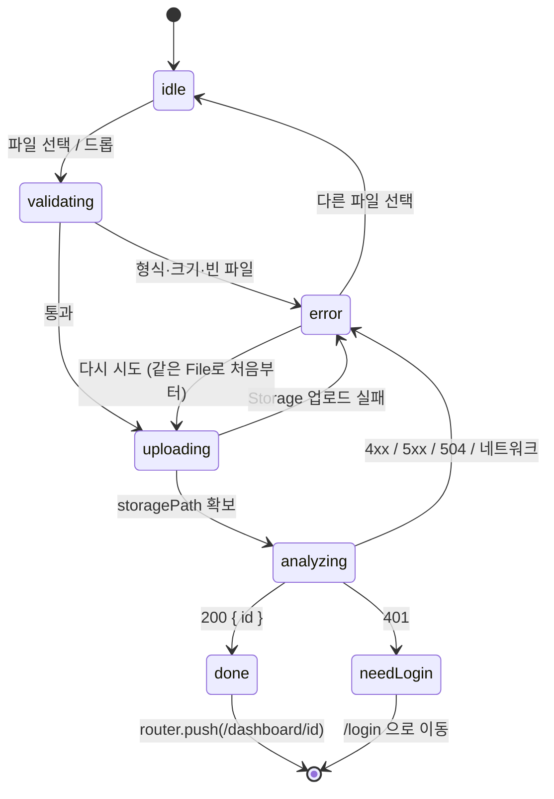

# SlipScan MVP 구현 계획 (리뷰용 정리본)

## §0. 이 문서에 대해

### 0.1 문서 성격

이 문서는 SlipScan MVP의 기획·설계·실행 계획을 **리뷰 목적으로 한 파일에 정리한 것**이다. 원본은 아래 파일들이며, 이 문서와 원본이 충돌하면 **원본이 기준**이다. 충돌을 발견하면 그것 자체를 리뷰 지적 사항으로 보고하라.

| 원본 | 역할 |
|------|------|
| `CLAUDE.md` | 프로젝트 규칙. CRITICAL 규칙과 개발 프로세스 |
| `docs/PRD.md` | 범위. 핵심 기능, 입력 제약, 결과 스키마, MVP 제외 |
| `docs/ADR.md` | 기술 결정 8건과 트레이드오프 |
| `docs/ARCHITECTURE.md` | 디렉토리 구조, 인터페이스, 패턴, 데이터 흐름, 데이터 모델, 환경 변수 |
| `docs/USER_FLOWS.md` | 페르소나, 저니, 상태 머신, 유스케이스, 예외 표 |
| `docs/UI_GUIDE.md` | 디자인 토큰, 컴포넌트 클래스, 안티패턴 |
| `supabase/migrations/0001_init.sql` | DB 테이블, RLS, Storage 버킷·정책 |
| `phases/0-mvp/step0.md` ~ `step11.md`, `phases/0-mvp/index.json` | 실행 단위 12개. 각 파일은 독립된 Claude 세션이 headless로 실행한다 |
| `.claude/commands/harness.md`, `scripts/execute.py` | 실행 하네스 규칙과 러너 |

실행 방식이 중요하다: `scripts/execute.py`가 `CLAUDE.md`와 `docs/*.md` 전체를 매 step 프롬프트 앞에 붙이고, 완료된 step의 `summary`를 누적해 다음 step에 전달한다. 따라서 docs는 "참고 문서"가 아니라 **매 step에 주입되는 가드레일**이다. docs 사이의 모순은 곧바로 실행 오류로 이어진다.

### 0.2 리뷰 요청 사항 (우선순위 순)

1. **step 간 일관성·누락·순서**: step N이 만드는 시그니처를 step N+k가 다른 이름·타입으로 참조하지 않는가. 어떤 step이 아직 없는 파일을 "읽어야 할 파일"로 요구하지 않는가. docs와 step 사이에 문구·상태 코드·경로가 어긋나지 않는가.
2. **기술적 정확성**: Next 16(`proxy.ts`, Promise `params`/`searchParams`/`cookies()`, `next lint` 제거), `@supabase/ssr`(`getAll`/`setAll`, `getUser()` 신뢰), zod v4(`z.toJSONSchema`, `.catch()`, `io: 'input'`), Anthropic SDK(`document`/`image` 블록, `tool_choice: { type: 'tool' }`, `input_schema` 타입), Vercel(4.5MB 본문, `maxDuration`), Supabase Storage 정책 문법. 틀린 API 가정은 headless 실행에서 3회 재시도 후 `error`로 끝난다.
3. **과잉 설계 잔존 또는 필수 요소 누락**: 이 계획은 직전 검수에서 14개 항목을 잘라냈다(§11). 그 기준으로 봤을 때 아직 남은 과잉, 또는 반대로 시연 MVP에 반드시 필요한데 빠진 것.

### 0.3 지적하지 말아야 할 것

§11 "의도적으로 제외한 것"과 §12 "감수하는 제한"에 있는 항목은 결정이 끝났다. 그 결정의 **근거가 틀렸다**고 판단될 때만 지적하라.

### 0.4 기대 출력 형식

```
[blocker|major|minor] <위치: §번호 또는 S번호> — <한 줄 요약>
근거: <원본 파일과 절, 또는 공식 문서 근거>
수정안: <구체적 변경>
```

blocker = 그대로 실행하면 step이 `error`로 끝나거나 CRITICAL 규칙을 위반한다. major = 동작은 하지만 설계 의도와 어긋나거나 다음 step을 깨뜨릴 가능성이 높다. minor = 문구·명명·가독성.

---

## §1. 제품 요약

중소기업 경비 담당자가 영수증·카드명세서 PDF/이미지를 올리면 Claude API가 가맹점·일자·금액·부가세·품목을 추출해 대시보드에 보여주고 보관하는 웹앱. 목적은 수기 입력 제거. MVP는 **개인 계정 단위, 시연용**이다. 회사·팀·직원 권한 개념이 없고, 공개 가입이 없으며, 계정은 운영자가 Supabase 대시보드에서 발급한다. 시연 대상은 외부 결정권자 1명이며 미리 만든 시연 계정 하나로 어느 기기에서든 같은 데이터를 본다.

---

## §2. 범위

### 2.1 포함 (PRD 핵심 기능)

| # | 기능 | 구현 step |
|---|------|-----------|
| F1 | 랜딩 `/`: 소개와 CTA. 로그인 상태면 `/dashboard`로 redirect | S10 |
| F2 | 인증: 운영자 발급 계정으로 이메일+비밀번호 또는 Google 로그인, 로그아웃. 비로그인 `/dashboard/**` → `/login` | S2, S3 |
| F3 | 업로드·분석: 파일 1개 → Claude 분석 → 저장 → 상세 이동. 진행 상태 표시, 실패 원인 메시지 | S4, S5, S7 |
| F4 | 대시보드: 내 분석 목록(최신순, 최근 100건)과 요약 카드(전체 건수, 이번 달 합계). 요약은 그 목록에서 계산. 이번 달 합계 = 문서 일자가 이번 달인 KRW 항목의 합, 일자 null은 제외 | S1, S6 |
| F5 | 상세: 추출 결과(유형, 가맹점, 일자, 합계, 부가세, 카테고리, 품목/거래 표), 원본 미리보기(서명 URL 5분), 삭제. confidence < 0.6이면 "확인 필요" 배지, `unknown`이면 안내와 삭제 유도 | S6, S7 |
| F6 | 라이트/다크 테마 토글. 기본값 시스템 | S0 |
| F7 | 결과 수정: 가맹점·일자·합계·부가세·카테고리 5개 필드 인라인 편집. "수정됨" 표시 | S1, S2, S5, S8 |
| F8 | CSV 내보내기: 목록(최근 100건)을 분석 1건 = 1행, UTF-8 BOM | S9 |

입력 제약: `application/pdf`·`image/jpeg`·`image/png`·`image/webp`만. PDF 20MB(100페이지 이하), 이미지 5MB. 한 번에 1개. HEIC 미지원. 환불 영수증은 음수 금액이며 월 합계에서 차감되고 수정 폼도 음수를 허용한다.

### 2.2 제외 (PRD "MVP 제외 사항" 그대로)

- 회사·팀·직원 권한, 승인 워크플로우
- 품목·거래·문서 유형 편집, 재분석
- 품목·거래 행 단위 내보내기, xlsx, 회계 시스템 연동
- 공개 회원가입, 앱 내 초대·역할 관리, 비밀번호 재설정(운영자가 대시보드에서 변경), Google 외 소셜 로그인
- 이미지 자동 축소, HEIC 변환, 다중 파일 일괄 업로드
- 비동기 큐 (분석은 요청 안에서 동기 처리, 최대 60초)
- 목록 페이지네이션·검색·월별 필터 (최근 100건만 표시하고 요약 카드도 그 기준)
- 사용량 한도와 남용 방어(요청 출처 검사, 업로드 파일 내용 검사, 모델 원본 추출값 보존). 공개 가입이 없어 사용자는 전부 운영자 발급 계정이다
- OpenAI 등 다른 LLM 구현체 (인터페이스만 둔다)
- 다국어 (한국어 고정)

---

## §3. 불변 규칙 (CLAUDE.md)

**CRITICAL** — 위반은 그 자체로 blocker다.

| ID | 규칙 | 이유 |
|----|------|------|
| C1 | `ANTHROPIC_API_KEY`와 Claude 호출은 서버 코드(`src/app/api/**`, `src/services/**`)에서만. `NEXT_PUBLIC_` 접두사 금지, 클라이언트 컴포넌트에서 import 금지 | 키 노출 |
| C2 | Supabase 접근은 항상 사용자 세션 기반 클라이언트(anon key + 쿠키). 데이터 격리는 RLS. `service_role` 키는 어디에도 쓰지 않는다 | RLS 우회 방지 |
| C3 | 파일 바이너리는 클라이언트에서 Supabase Storage로 직접 업로드. API 라우트에 파일 본문을 보내지 않는다 | Vercel 서버리스 요청 본문 4.5MB 제한 |
| C4 | 페이지·컴포넌트·API 라우트는 `DocumentAnalyzer`, `AnalysisRepository` 인터페이스(`src/services/**`)에만 의존. `@anthropic-ai/sdk`, `@supabase/supabase-js`를 `src/services/`, `src/lib/supabase/` 밖에서 import 하지 않는다 | 교체 가능성, 테스트 mock |
| C5 | 새 기능은 반드시 테스트를 먼저 쓰고 통과하는 구현을 쓴다 (TDD) | — |

기타 아키텍처 규칙: 읽기는 Server Component에서 repository 직접 호출, 쓰기(분석·삭제·수정)는 `src/app/api/**` 라우트 핸들러. 컴포넌트는 `src/components/`, 도메인 타입은 `src/types/`, 외부 서비스 래퍼는 `src/services/`, 유틸·클라이언트 팩토리는 `src/lib/`. UI는 `docs/UI_GUIDE.md` 토큰을 따르고 `dark:` 변형을 직접 쓰지 않는다.

개발 프로세스: 외부 SDK(Supabase, Anthropic)는 테스트에서 mock. 실제 네트워크 테스트 금지. 커밋은 conventional commits. 명령어: `npm run dev` / `build` / `lint` / `test`(Vitest 단일 실행).

---

## §4. 기술 스택과 ADR

스택: Next.js 16 (App Router, `src/`, Turbopack), React 19, TypeScript strict, Tailwind CSS v4, next-themes, lucide-react, Supabase(`@supabase/ssr`), `@anthropic-ai/sdk`, zod v4, Vitest + React Testing Library.

ADR 철학: MVP 속도 최우선. 관리형 서비스에 기대고 직접 운영하는 인프라는 없다. 외부 서비스는 인터페이스 한 겹 뒤에 두되 "나중을 위한" 추상화는 그 한 겹까지만.

| ID | 결정 | 이유 | 트레이드오프 |
|----|------|------|--------------|
| ADR-001 | Next 16 App Router + TS strict + Tailwind v4 | Vercel 마찰 최소, Server Components로 조회 단순, v4는 CSS 변수 토큰이 기본 | `middleware.ts`→`proxy.ts`, `next lint` 제거 등 과거 예제와 차이 |
| ADR-002 | Supabase Auth, 공개 가입 없음. 운영자가 Users → Add user(Auto Confirm)로 발급. 이메일+비밀번호 또는 Google OAuth(PKCE, `/auth/callback`). 인증 호출은 전부 브라우저 클라이언트(서버 액션 없음) | 셀프 가입 불필요. 가입을 열면 (a) 남의 이메일 선점 계정에 Google 로그인이 연결되는 탈취, (b) 임의 사용자의 유료 분석 호출 비용 노출 | 셀프 온보딩 없음. 비밀번호 전달·재설정을 운영자가 대시보드에서 |
| ADR-003 | Postgres `analyses`(`result jsonb`) + 비공개 버킷 `receipts`의 `{user_id}/{uuid}.{ext}`. RLS와 Storage 정책으로 본인만. `service_role` 없음 | 기기 무관 동일 데이터. 추가 비용 테이블 1개·버킷 1개 | jsonb라 스키마 변경 시 옛 행 혼재 → 선택 필드는 nullable, LLM 출력 파싱은 관대 |
| ADR-004 | 브라우저가 Storage에 직접 업로드, API에는 `storagePath`만. 서버가 내려받아 분석 | Vercel 본문 4.5MB. Storage 정책이 사용자 폴더를 강제해 보안 손실 없음 | 업로드 후 분석 실패 시 고아 파일 → API가 실패 경로에서 `storage.remove` |
| ADR-005 | Claude API. PDF는 `document` 블록, 이미지는 `image` 블록(base64). 단일 도구 `record_analysis`(input_schema = zod → `z.toJSONSchema()`)와 `tool_choice: { type: 'tool' }` 강제, 받은 input을 zod로 재파싱. 모델은 `ANTHROPIC_MODEL`, 기본 `claude-opus-5`. 호출은 `max_tokens: 16000`, `output_config: { effort: 'low' }`, thinking 기본값(adaptive). `DocumentAnalyzer` 인터페이스 뒤 | PDF 네이티브 입력. tool use 강제는 "JSON만 출력해"보다 형식 오류가 훨씬 적음 | 동기 호출이라 `maxDuration = 60`, 큰 PDF 느림, 호출마다 비용(Opus 5는 Sonnet 5의 2.5배, 2026-09-15 정확도 우선으로 변경) |
| ADR-006 | Repository 패턴 + 생성자 주입. 화면·API는 인터페이스 타입과 `createAnalysisRepository()` 팩토리만 보고 구현 클래스를 import 하지 않음. ESLint `no-restricted-imports`로 강제 | 구현체 교체 용이, mock 주입 쉬움 | 파일 수 증가. RLS가 있어 `userId` 인자가 중복이지만 DB 독립성을 위해 유지 |
| ADR-007 | Vitest + RTL. 단위·컴포넌트 테스트만. Supabase·Anthropic은 mock. e2e 없음 | `.claude/settings.json` Stop 훅이 매번 `lint && build && test`를 돌리므로 빠르고 결정적이어야 함 | 실제 연동은 `npm run dev`로 수동 검증 |
| ADR-008 | next-themes `attribute="class"`, 기본 `system`. `globals.css`의 `:root`/`.dark`에 토큰, `@theme inline`으로 Tailwind 유틸리티(`bg-page`, `text-fg` 등) 연결. 컴포넌트는 토큰 클래스만 | 컴포넌트마다 `dark:`를 붙이면 누락 발생 | `<html suppressHydrationWarning>` 필요, 토큰 이름 학습 |
| ADR-009 | 배포는 Vercel CLI. 사용자가 한 번 `vercel login`·`vercel link`·`vercel env add`. 이후 `execute.py`가 step 완료마다 `vercel deploy --yes`(preview, `preview_url` 기록), phase 완료 시 `vercel deploy --prod --yes`. `.vercel/` 미커밋. 미연결이면 배포만 건너뜀 | push 없이 로컬 상태를 첫 step부터 실제 Vercel에서 확인. production에는 완성본만 | 배포마다 1~3분, 로그인·link가 사전 조건. preview 실패는 경고만, production 실패는 중단 |

---

## §5. 아키텍처

### 5.1 디렉토리 구조

```
src/
├── app/
│   ├── layout.tsx                     # html/body, ThemeProvider
│   ├── error.tsx                      # 한국어 에러 경계 + 다시 시도
│   ├── page.tsx                       # 랜딩. 로그인 상태면 /dashboard로 redirect
│   ├── globals.css                    # Tailwind v4 + 테마 토큰
│   ├── (auth)/layout.tsx              # 중앙 정렬 카드 레이아웃
│   ├── (auth)/login/page.tsx
│   ├── auth/callback/route.ts         # GET: OAuth code → 세션 교환 → /dashboard
│   ├── (app)/layout.tsx               # 세션 필수. 없으면 /login. 앱 헤더
│   ├── (app)/dashboard/page.tsx       # 요약 카드 + 업로드 + 목록
│   ├── (app)/dashboard/[id]/page.tsx  # 분석 상세
│   ├── (app)/dashboard/[id]/not-found.tsx
│   ├── api/analyses/route.ts          # POST: 분석 실행 (HTTP 메서드와 설정 상수만 export)
│   ├── api/analyses/[id]/route.ts     # DELETE: 삭제, PATCH: 결과 수정
│   ├── api/analyses/handler.ts        # createPostHandler / createDeleteHandler / createPatchHandler (deps) — 순수 로직
│   └── api/analyses/deps.ts           # buildDeps(): 실제 Supabase·Claude 구현체 조립
├── proxy.ts                           # Next 16 proxy (구 middleware): 세션 갱신 + 라우트 가드
├── components/
│   ├── ui/                            # Button, Input, Card, Badge
│   ├── theme-provider.tsx, theme-toggle.tsx, app-header.tsx
│   ├── auth/                          # LoginForm, GoogleButton, SignOutButton
│   ├── dashboard/                     # SummaryCards, AnalysisList, EmptyState, AnalysisDetail, SummaryGrid,
│   │                                  #   DeleteAnalysisButton, EditAnalysisForm, ExportCsvButton
│   ├── upload/                        # UploadForm
│   └── landing/                       # LandingHeader, FeatureList
├── test/setup.ts                      # Vitest 설정 (jest-dom, cleanup, matchMedia)
├── types/analysis.ts                  # AnalysisResult, Analysis, AnalysisSummary, 상수
├── lib/
│   ├── supabase/client.ts             # createBrowserSupabase()
│   ├── supabase/server.ts             # createServerSupabase(), getCurrentUser() (React cache)
│   ├── supabase/proxy.ts              # updateSession(request)
│   ├── supabase/guard.ts              # decideRedirect(pathname, hasUser) — 순수 함수
│   ├── schemas/analysis.ts            # zod: AnalysisResult, API 요청 본문, JSON Schema 변환
│   ├── schemas/auth.ts                # zod: 이메일·비밀번호
│   ├── upload/validate-file.ts        # 파일 형식·크기 검증 (순수 함수)
│   ├── csv.ts                         # analysesToCsv(items) (순수 함수, UTF-8 BOM)
│   └── utils/                         # format.ts(금액·날짜), summary.ts(monthRange, computeSummary)
└── services/
    ├── analyzer/{types,prompt,claude-analyzer,index}.ts
    ├── repository/{types,supabase-analysis-repository,index}.ts
    └── storage/{types,supabase-receipt-storage,index,browser-upload}.ts
supabase/migrations/0001_init.sql
vitest.config.ts
```

### 5.2 핵심 인터페이스

```ts
// src/services/analyzer/types.ts
export interface AnalyzeInput { data: Uint8Array; mimeType: string; fileName: string }
export interface DocumentAnalyzer { analyze(input: AnalyzeInput): Promise<AnalysisResult> }
export class AnalyzerError extends Error {
  constructor(message: string, public readonly code: 'unsupported_file' | 'invalid_output' | 'rejected_input' | 'provider_error')
  // rejected_input: 제공자가 입력 자체를 거부(암호 PDF, 페이지·해상도 초과). 재시도 무의미 → 422
}

// src/services/repository/types.ts
export interface CreateAnalysisInput {
  userId: string; fileName: string; mimeType: string; storagePath: string; result: AnalysisResult
}
export interface AnalysisRepository {
  create(input: CreateAnalysisInput): Promise<Analysis>
  listByUser(userId: string): Promise<AnalysisSummary[]>        // 최신순, 최근 100건
  getById(id: string, userId: string): Promise<Analysis | null>
  delete(id: string, userId: string): Promise<Analysis | null>   // 지운 행을 돌려준다 (파일 정리용). 없으면 null
  update(id: string, userId: string, patch: Partial<EditableFields>): Promise<Analysis | null>  // result 병합 + edited_at
}

// src/services/storage/types.ts
export interface ReceiptStorage {
  download(storagePath: string): Promise<Uint8Array>
  remove(storagePath: string): Promise<void>
  createSignedUrl(storagePath: string, expiresInSeconds: number): Promise<string>
}
```

구현체는 생성자로 외부 클라이언트(SupabaseClient, Anthropic)를 받는다. 페이지·API는 `services/*/index.ts`의 팩토리(`createAnalysisRepository`, `createReceiptStorage`, `createDocumentAnalyzer`)만 import 한다. ESLint `no-restricted-imports`가 이 경계를 강제한다.

### 5.3 패턴

| ID | 패턴 |
|----|------|
| P1 | Server Components 기본. 폼·업로드·테마 토글처럼 인터랙션이 필요한 곳만 `'use client'` |
| P2 | Next 16: `cookies()`, `params`, `searchParams`는 Promise. 반드시 `await` |
| P3 | 읽기: Server Component → `createServerSupabase()` → `createAnalysisRepository(supabase)` → 조회 → 렌더. 자기 API를 fetch 하지 않음. 대시보드 요약은 조회한 목록에서 `computeSummary()` |
| P4 | 쓰기: Client Component → `fetch('/api/analyses', ...)` → 라우트 핸들러가 services 조합. 수정은 `PATCH /api/analyses/{id}`에 변경 필드만 |
| P5 | API 라우트: `route.ts`는 HTTP 메서드와 `runtime`/`maxDuration`만 export. 로직은 `handler.ts` 팩토리가 `deps`를 받아 만든다. 테스트는 가짜 `deps`로 핸들러 직접 호출 |
| P6 | 인증: 브라우저 클라이언트로 `signInWithPassword` / `signInWithOAuth({ provider: 'google' })` / `signOut`. 성공 후 `router.push()` + `router.refresh()`. Google은 `redirectTo: ${origin}/auth/callback`, 콜백이 `exchangeCodeForSession(code)` 후 `/dashboard` |
| P7 | 라우트 가드: `src/proxy.ts`가 페이지 요청마다 세션 갱신 후 `decideRedirect()`. 비로그인 `/dashboard/**` → `/login`, 로그인 상태 `/login` → `/dashboard`. `/auth/callback`은 redirect 없음, `/api/**`는 matcher 제외. Server Component는 `getCurrentUser()`(React `cache`)로 요청당 1회 조회 |
| P8 | 검증 경계: LLM 출력, API 요청 본문, 폼 입력, 업로드 파일은 zod 또는 순수 함수로 파싱. 내부 함수 간에는 타입 신뢰. DB `result` jsonb는 서버만 쓰므로 읽을 때 캐스팅 |
| P9 | 응답 헤더(`next.config.ts`): `X-Frame-Options: DENY`, `frame-ancestors 'none'`, `nosniff`, `Referrer-Policy: strict-origin-when-cross-origin`. 세션 쿠키는 `sameSite: lax` + `secure`(프로덕션). HttpOnly는 브라우저 클라이언트가 읽어야 해서 끔 |
| P10 | API 방어: `storagePath`는 허용 목록 정규식 `^{userId}/{uuid}.{ext}$`만 통과. 그 외 남용 방어는 MVP 제외 (ADR-002) |
| P11 | 에러: `{ error: string }` 고정 한국어 문구 + HTTP 상태. 예외 메시지는 서버 로그에만. 클라이언트는 `error`를 그대로 표시 |

### 5.4 데이터 흐름

```
업로드·분석:
사용자 파일 선택
→ UploadForm(client): validateReceiptFile() 형식·크기 검증
→ uploadReceipt(): supabase.storage.from('receipts').upload(`${userId}/${uuid}.${ext}`, file)
→ POST /api/analyses  { storagePath, fileName, mimeType }
→ 핸들러: 세션 확인 → storagePath 정규식 검사
→ storage.download(storagePath) → 크기 재확인 → analyzer.analyze()
→ repository.create()
→ 200 { id }   (download 이후 실패 시 storage.remove 후 에러 응답)
→ router.push(`/dashboard/${id}`)

조회:     Server Component → repository.listByUser() / getById() → 렌더. 원본은 storage.createSignedUrl(path, 300)
삭제:     DELETE /api/analyses/{id} → repository.delete()(행 반환, 없으면 404) → storage.remove(storagePath) → 클라이언트가 /dashboard로
수정:     편집 폼 → PATCH /api/analyses/{id} { merchant?, date?, totalAmount?, vatAmount?, category? } → zod → repository.update() → 200 → router.refresh()
내보내기: 대시보드 Server Component가 목록을 ExportCsvButton props로 → 클라이언트에서 analysesToCsv() → Blob 다운로드. API 없음
```

상태 관리: 서버 상태는 Server Components가 매 요청 조회, 변경 후 `router.refresh()`. 클라이언트 상태는 `useState`로 업로드 단계와 폼 입력만. 전역 상태 라이브러리 없음.

### 5.5 HTTP 에러 코드

| 코드 | 의미 | 문구 |
|------|------|------|
| 400 | 요청 본문 스키마 실패 | "요청 형식이 올바르지 않습니다." (PATCH는 첫 번째 zod 메시지) |
| 401 | 미인증 | "로그인이 필요합니다." |
| 403 | 남의 `storagePath` | "접근할 수 없는 파일입니다." |
| 404 | 파일 또는 분석 없음 | "파일을 찾을 수 없습니다." / "분석을 찾을 수 없습니다. 이미 삭제되었을 수 있습니다." |
| 413 | 크기 초과 | "파일이 너무 큽니다. PDF 20MB, 이미지 5MB 이하만 가능합니다." |
| 422 | LLM 출력 파싱 실패 / 제공자 입력 거부 | "분석 결과를 읽을 수 없습니다. 다른 파일로 시도하세요." / "이 파일은 분석할 수 없습니다. 암호가 걸렸거나 페이지 수·해상도가 너무 큽니다." |
| 502 | LLM 일시 장애 | "분석 서비스 호출에 실패했습니다. 잠시 후 다시 시도하세요." |
| 500 | 그 외 | "분석 중 오류가 발생했습니다." |

### 5.6 환경 변수

| 이름 | 노출 | 용도 |
|------|------|------|
| `NEXT_PUBLIC_SUPABASE_URL` | 클라이언트 OK | Supabase 프로젝트 URL |
| `NEXT_PUBLIC_SUPABASE_ANON_KEY` | 클라이언트 OK | anon key 또는 publishable key |
| `ANTHROPIC_API_KEY` | 서버 전용 | Claude API |
| `ANTHROPIC_MODEL` | 서버 전용, 선택 | 기본 `claude-opus-5` |

같은 변수(선택 포함)를 Vercel 프로젝트에도 등록한다 (`vercel env add <이름> production preview` 또는 대시보드). 배포 흐름은 ADR-009.

Google OAuth Client ID/Secret은 Supabase 대시보드에만 등록한다. 앱 환경변수에 넣지 않는다.

---

## §6. 데이터 모델

### 6.1 AnalysisResult (PRD 스키마. 필드 추가·삭제·개명 금지)

| 필드 | 타입 | 설명 |
|------|------|------|
| documentType | `receipt` / `card_statement` / `unknown` | 문서 유형 |
| merchant | string / null | 가맹점명 |
| date | `YYYY-MM-DD` / null | 거래일 또는 명세서 기준일 |
| currency | string | 기본 `KRW` |
| totalAmount | number | 합계 (환불은 음수) |
| vatAmount | number / null | 부가세. 표기 없으면 null |
| category | `식비`/`교통`/`숙박`/`소모품`/`접대`/`통신`/`기타` / null | 지출 분류 |
| items | `{ name, quantity, amount }[]` | 영수증 품목. 없으면 `[]` |
| transactions | `{ date, merchant, amount, category }[]` | 카드명세서 거래. 없으면 `[]` |
| confidence | number 0~1 | 판독 신뢰도 |
| notes | string / null | 판독 불가 항목, 주의사항 |

파생 타입(S1): `Analysis { id, userId, fileName, mimeType, storagePath, result, createdAt, editedAt }`, `AnalysisSummary`(목록용 평탄화), `EDITABLE_FIELDS = ['merchant','date','totalAmount','vatAmount','category']`, `ALLOWED_MIME_TYPES` 4종, `MAX_PDF_BYTES = 20MB`, `MAX_IMAGE_BYTES = 5MB`.

### 6.2 검증 정책

**LLM 출력(`analysisResultSchema`)은 관대하게.** `documentType`·`totalAmount`만 필수. `z.toJSONSchema()`가 변환 못 하는 기능(`transform`, `preprocess`, `z.date`)은 금지하고 아래 조합만 쓴다 (zod 4.6에서 변환·파싱 확인됨):

| 상황 | 조합 |
|------|------|
| 누락 시 null (merchant 200자, notes 2000자) | `z.string().max(n).nullable().catch(null)` |
| 누락·500개 초과 시 빈 배열 | `z.array(...).max(500).catch([])` |
| 형식 불일치 시 null | `z.string().regex(/^\d{4}-\d{2}-\d{2}$/).nullable().catch(null)`, `z.enum(EXPENSE_CATEGORIES).nullable().catch(null)` |
| 범위 밖이면 기본값 | `z.number().min(0).max(1).catch(0.5)` |
| currency | `z.string().default('KRW')` |

JSON Schema는 `z.toJSONSchema(schema, { io: 'input' })`에서 `$schema` 제거 후 `ToolInputSchema`(반드시 `type` 별칭, `type: 'object'` 리터럴)로 캐스팅. `io: 'input'`을 쓰는 이유: 기본 `output` 모드는 `.default()` 필드까지 `required`에 넣는다. `.catch()` 필드는 `input`에서도 `required`에 남는데 의도된 것이다.

**사용자 입력(`updateAnalysisRequestSchema`)은 엄격하게.** `merchant` trim 후 1~100자 또는 null, `date`는 형식 불일치 시 에러, `totalAmount` 유한 숫자(음수 허용), `vatAmount` 유한 숫자 또는 null, `category`는 목록 또는 null. 모두 optional이지만 최소 1개(`refine`), 알 수 없는 키 거부(`strict`), 한국어 메시지.

### 6.3 DB (`supabase/migrations/0001_init.sql`, 대시보드 SQL Editor에서 수동 실행, 멱등)

```sql
public.analyses (
  id           uuid primary key default gen_random_uuid(),
  user_id      uuid not null references auth.users(id) on delete cascade,
  file_name    text not null,
  mime_type    text not null,
  storage_path text not null,
  result       jsonb not null,          -- AnalysisResult (사용자 수정 반영)
  created_at   timestamptz not null default now(),
  edited_at    timestamptz              -- 사용자 수정 시각. null이면 미수정
  -- check: storage_path like user_id || '/%', mime_type in (허용 4종)
  -- unique: storage_path
)
-- RLS: select / insert / update / delete 모두 auth.uid() = user_id (authenticated)
-- index: (user_id, created_at desc)

storage.buckets 'receipts': public=false, file_size_limit=20MB, allowed_mime_types = pdf/jpeg/png/webp
-- storage.objects 정책: (storage.foldername(name))[1] = auth.uid()::text 인 경우만 select/insert/delete
-- update 정책은 의도적으로 없음 (앱은 upsert:false만 사용)
-- 마지막에 notify pgrst, 'reload schema'
```

---

## §7. 사용자 흐름 (USER_FLOWS 압축)

페르소나: P1 경리·총무 담당자(주 사용자, 월말 30~100장), P2 1인 사업자(모바일 촬영), P3 결정권자(시연 대상), P4 시연자(운영자). 핵심 가설 H1 "업로드→표가 수기 입력보다 빠르다"(60초 이내), H2 "합계가 맞으면 신뢰하고 틀리면 직접 고친다"(수정 기능), H6 "최종 산출물은 표 파일"(CSV).

### 7.1 화면 지도



점선은 `proxy.ts`와 서버 컴포넌트가 자동으로 보내는 이동이다.

### 7.2 업로드·분석 상태 머신



| 상태 | 화면 | 입력 |
|------|------|------|
| idle | 점선 업로드 영역, "PDF 20MB, 이미지(JPEG·PNG·WEBP) 5MB 이하" | 클릭·드롭 가능 |
| validating | 즉시 판정 (화면 변화 없음, 렌더 상태 아님) | - |
| uploading | 스피너 + "업로드 중…" | 잠김 |
| analyzing | 스피너 + "분석 중… 최대 1분 걸릴 수 있습니다." | 잠김 |
| error | 빨간 테두리 + 원인 문구 + "다시 시도" / "다른 파일 선택" | 파일 선택 가능 |
| needLogin | "세션이 만료되었습니다." + 로그인 링크 | - |

`analyzing` 중 페이지를 떠나도 서버는 분석을 끝내고 저장한다.

### 7.3 예외·엣지 케이스

| 상황 | 사용자에게 보이는 것 | 시스템 동작 | step |
|------|---------------------|-------------|------|
| 업로드 성공 후 분석·저장 실패 | 원인 문구 + 다른 파일 선택 | API가 `storage.remove`로 파일 정리 | S5 |
| 분석 60초 초과 | "시간이 초과되었습니다. 페이지 수가 적은 파일로 다시 시도하세요." | Vercel 504, 본문이 JSON이 아님 → 폼이 상태 코드로 판단. Storage 파일이 남을 수 있다 (MVP 감수) | S7 |
| 세션 만료 중 업로드 | "세션이 만료되었습니다." + 로그인 링크 | 401. Storage 파일이 남을 수 있다 (MVP 감수) | S7 |
| 네트워크 끊김 | "네트워크 오류입니다. 다시 시도하세요." | fetch reject | S7 |
| 영수증이 아닌 사진 | 판독 불가 화면, notes에 사유 | `unknown`, `totalAmount 0` | S4, S6 |
| 한 사진에 영수증 여러 장 | 한 장만 인식, notes에 "여러 장 감지" | 프롬프트 규칙 | S4 |
| 스캔 품질 낮음 | 결과 + "확인 필요" 배지 | `confidence < 0.6` | S4, S6 |
| 이미지 PDF (스캔본) | 정상 처리 | Claude가 PDF 이미지를 읽음 | S4 |
| 암호 PDF, 100페이지 초과, 8000px 초과 | "이 파일은 분석할 수 없습니다. …" (재시도 안내 없음) | Claude 4xx → `rejected_input` → 422 | S4, S5 |
| 다른 탭에서 삭제된 항목을 수정 | "이미 삭제된 항목입니다." → 대시보드로 | PATCH 404 | S5, S8 |
| 환불 영수증 | "-12,000원", 월 합계에서 차감 | 음수 허용 | S1, S6 |
| 서명 URL(5분) 만료 후 뒤로가기 | "원본을 불러올 수 없습니다. 새로고침하세요." | iframe/img 로드 실패 | S6 |
| 분석 중 새로고침 | 대시보드 목록에 결과가 나타남 | 서버는 응답과 무관하게 저장 | S5 |
| Google 앱 테스트 모드 | Google 경고 또는 거부 | 운영 설정 문제. README | S11 |
| 목록 100건 초과 | 최근 100건만 표시. 요약 카드도 그 100건 기준 | `listByUser` limit 100 (MVP 감수) | S2 |

### 7.4 시연 시나리오

사전 준비: 시연 계정, 영수증 3건 + 카드명세서 1건 미리 분석, 라이브용 영수증 JPEG 1장. 순서: 랜딩(비로그인) → 이메일 로그인 → 대시보드(합계, 4건) → 카드명세서 상세(거래 표 + 원본 PDF) → 영수증 JPEG 드롭 → 업로드 중/분석 중(10~30초) → 상세 → 원본 대조, 테마 토글 → 삭제 시연 → 로그아웃. **시연 중 피할 것: Google 로그인(동의 화면 변수), 5MB 넘는 사진, 20페이지 넘는 PDF, 실제 직원 데이터.**

---

## §8. UI 규칙 (UI_GUIDE 압축)

원칙: 도구처럼 보여야 한다. 표와 숫자가 주인공. 라이트·다크 모두 1급. 컴포넌트는 토큰 클래스만 쓰고 테마별 색은 `globals.css` 변수에서만 바꾼다.

**금지(안티패턴)**: `backdrop-filter: blur()`, 그라데이션 텍스트, "Powered by AI" 배지, 글로우 애니메이션, 보라/인디고 브랜드색, 모든 카드에 동일한 `rounded-2xl`, 배경 gradient orb(`blur-3xl`), 컴포넌트 안 `dark:`, 이모지 아이콘.

**토큰 → 클래스**: `bg-page`(#fafafa/#0a0a0a), `bg-card`(#fff/#141414), `bg-card-2`(#f5f5f5/#1a1a1a), `border-line`(#e5e5e5/#262626), `text-fg`(#171717/#fafafa), `text-fg-2`, `text-fg-3`, `text-fg-4`, `bg-accent`/`text-accent`(#2563eb/#3b82f6), `text-success`, `text-error`/`border-error`, `text-warning`. 포인트 색은 한 화면에 한 곳(primary 액션)만.

**컴포넌트 클래스**:
```
카드:      rounded-lg bg-card border border-line p-6
Primary:   rounded-md bg-accent text-white px-4 py-2 text-sm font-medium hover:opacity-90 disabled:opacity-50
Secondary: rounded-md border border-line bg-card text-fg px-4 py-2 text-sm hover:bg-card-2
Text:      text-fg-3 hover:text-fg text-sm
Danger:    rounded-md border border-error text-error px-4 py-2 text-sm hover:bg-card-2
입력:      rounded-md bg-card border border-line px-3 py-2 text-sm text-fg placeholder:text-fg-4 focus:outline-none focus:ring-2 focus:ring-accent/40 (에러: border-error + text-error text-xs)
표:        컨테이너 overflow-x-auto / w-full text-sm / thead text-left text-fg-3 font-medium border-b border-line / tbody tr border-b border-line hover:bg-card-2 / 금액 셀 text-right tabular-nums
배지:      inline-flex rounded-md border border-line px-2 py-0.5 text-xs text-fg-2 (경고: text-warning border-warning)
업로드:    rounded-lg border border-dashed border-line p-8 text-center (드래그 오버: border-accent)
```

레이아웃: `max-w-5xl mx-auto px-6`, 인증 페이지만 `max-w-sm`. 좌측 정렬 기본(인증 카드·빈 상태만 중앙). 섹션 간 `space-y-8`. 앱 헤더 `h-14 border-b border-line`. 타이포: 랜딩 헤드라인 `text-4xl font-semibold tracking-tight`, 페이지 제목 `text-2xl font-semibold`, 요약 숫자 `text-2xl font-semibold tabular-nums`. 금액은 `Intl.NumberFormat('ko-KR')` + `원`. 애니메이션은 fade-in 0.2s, 스피너, `transition-colors`만. 아이콘은 `lucide-react`, `strokeWidth={1.5}`, 배경 박스 없이 텍스트 옆에.

---

## §9. 실행 하네스

`python3 scripts/execute.py 0-mvp [--push]`가 step을 순차 실행한다.

- **브랜치** `feat-0-mvp` 생성/checkout.
- **Vercel 자동 배포**(ADR-009): `.vercel/project.json`과 `vercel` CLI가 있으면 step 완료마다 `vercel deploy --yes`(preview, URL을 `index.json`의 `preview_url`에 기록), phase 완료 시 `vercel deploy --prod --yes`(production). 미연결이면 건너뛴다. preview 실패는 경고, production 실패는 중단. 사전 조건(사용자가 한 번): `npm i -g vercel` → `vercel login` → 루트에서 `vercel link` → `vercel env add`로 §5.6 변수 등록.
- **가드레일 주입**: 매 step 프롬프트 = `CLAUDE.md` + `docs/*.md` 전체 + 완료된 step들의 `summary` + (재시도 시) 이전 에러 + 작업 규칙 + step 파일 본문.
- **작업 규칙**(프리앰블): 이전 step 코드와 일관성 유지 / 이 step에 명시된 작업만 / 기존 테스트 유지 / AC 직접 실행 / `index.json` status 갱신 / 커밋 `feat(0-mvp): step N — <name>`.
- **자가 교정**: 실패 시 최대 3회 재시도, 이전 에러를 프롬프트에 피드백.
- **2단계 커밋**: 코드(`feat`)와 메타데이터(`chore(0-mvp): step N output`) 분리.
- **Stop 훅**(`.claude/settings.json`): 세션 종료마다 `npm run lint && npm run build && npm run test`. `PreToolUse` 훅이 `rm -rf`, `git push --force`, `git reset --hard`, `DROP TABLE`을 차단.

**status 전이** (`phases/0-mvp/index.json`):

| 전이 | Claude 세션이 기록 | execute.py가 기록 | 복구 |
|------|-------------------|------------------|------|
| → `completed` | `summary` (다음 step에 전달되므로 생성 파일·핵심 결정 포함) | `completed_at` | — |
| → `error` (3회 실패) | `error_message` | `failed_at` | status를 `pending`으로, `error_message` 삭제 후 재실행 |
| → `blocked` (사용자 개입: 키, 외부 설정) | `blocked_reason` | `blocked_at` | 사유 해결 후 `pending`으로, `blocked_reason` 삭제 후 재실행 |

**step 파일 공통 골격**: `## 읽어야 할 파일` → `## 작업` → `## Acceptance Criteria`(실행 가능한 커맨드) → `## 검증 절차`(AC 실행, 아키텍처 체크리스트, status 갱신) → `## 금지사항`("X를 하지 마라. 이유: Y"). 모든 step의 AC는 최소 `npm run lint && npm run build && npm run test`이며 아래 §10에서는 추가 AC만 적는다.

**모든 step 공통 금지사항**: 기존 테스트를 깨뜨리지 마라. 이 step에 명시된 것 외의 기능·파일을 만들지 마라. `CLAUDE.md`, `docs/`, `scripts/`, `.claude/`, `supabase/`를 수정하지 마라. `phases/`는 `index.json`의 자기 step 항목만 수정하라. 컴포넌트에서 `dark:`를 쓰지 마라. `any`를 쓰지 마라. 실제 네트워크를 호출하는 테스트를 만들지 마라.

---

## §10. Step 계획

### 10.0 개요

| step | name | 주요 산출물 | 선행 | blocked 조건 |
|------|------|------------|------|--------------|
| S0 | project-setup | Next 스캐폴드, Vitest, ESLint 경계 규칙, 테마 토큰, UI 기본 요소, `.env.example` 확인 | — | — |
| S1 | core-types | `types/analysis.ts`, zod 스키마 + JSON Schema, 서비스 인터페이스, format/summary 유틸 | S0 | — |
| S2 | supabase-layer | 클라이언트 팩토리, `proxy.ts`, 가드, Repository·Storage 구현, 브라우저 업로드 | S1 | `.env.local` Supabase 변수 없음 / 마이그레이션 미적용 |
| S3 | auth-flow | 로그인 폼, Google 버튼, 로그아웃, `(auth)`·`(app)` 레이아웃, 콜백 라우트, 앱 헤더 | S2 | Google provider 꺼짐 / 공개 가입 열림 |
| S4 | claude-analyzer | 프롬프트, `ClaudeDocumentAnalyzer`, 팩토리 | S1 | `ANTHROPIC_API_KEY` 없음·무효 |
| S5 | analysis-api | `handler.ts`, `deps.ts`, POST/DELETE/PATCH 라우트 | S2, S4 | — |
| S6 | dashboard-pages | 대시보드·상세 컴포넌트와 페이지(읽기 전용) | S3, S2 | — |
| S7 | upload-flow | 파일 검증, `UploadForm`, `DeleteAnalysisButton`, 페이지 연결 | S5, S6 | — |
| S8 | edit-flow | `EditAnalysisForm`, 상세 페이지 연결 | S5, S6 | — |
| S9 | csv-export | `csv.ts`, `ExportCsvButton`, 대시보드 연결 | S6 | — |
| S10 | landing-page | `LandingHeader`, `FeatureList`, `/` | S2, S0 | — |
| S11 | deploy-docs | README(Vercel CLI 배포 절차 포함), `engines`, 배포 설정 점검 | 전부 | — |

### S0. project-setup

**목표**: 빌드·린트·테스트가 통과하는 빈 Next 16 앱과 테마 토큰, UI 기본 요소.

**핵심 규칙**
- 루트에 `CLAUDE.md`, `docs/` 등이 있어 `create-next-app`을 루트에서 직접 실행하면 충돌로 실패한다. 임시 디렉토리에서 `npx --yes create-next-app@latest slipscan --ts --tailwind --eslint --app --src-dir --import-alias "@/*" --use-npm --yes --skip-install --disable-git`로 만든 뒤 `package.json`, `tsconfig.json`, `next.config.ts`, `postcss.config.mjs`, `eslint.config.mjs`, `next-env.d.ts`, `src/`, `public/`만 복사한다. `README.md`, `AGENTS.md`, `.git/`은 복사하지 않는다. `.gitignore`는 덮어쓰지 않고 스캐폴드에만 있는 줄을 추가한다(`.env*`, `!.env.example`, `.vercel`은 이미 있음). 인식되지 않는 옵션은 빼고 재시도, React Compiler는 No.
- 의존성: `next-themes lucide-react zod @supabase/ssr @supabase/supabase-js @anthropic-ai/sdk server-only` / dev `vitest @vitejs/plugin-react jsdom @testing-library/react @testing-library/jest-dom @testing-library/user-event`.
- `vitest.config.ts`: `@vitejs/plugin-react`, `environment: 'jsdom'`, `setupFiles: ['./src/test/setup.ts']`, `include: ['src/**/*.test.{ts,tsx}']`, alias `@` → `./src`. **`globals`는 켜지 않는다** (`next build` 타입체크와 충돌). `src/test/setup.ts`: `@testing-library/jest-dom/vitest` import, `afterEach(cleanup)` 필수(globals off면 RTL 자동 cleanup이 없어 "found multiple elements" 실패), `window.matchMedia` 최소 구현(next-themes 사용). `"test": "vitest run"`. Next 16의 `lint`는 `eslint`이며 `next lint`가 아니다. `tsconfig.json` `include`에 `vitest.config.ts`.
- `eslint.config.mjs`에 `no-restricted-imports`: 적용 `src/components/**`, `src/app/**/page.tsx`, `src/app/**/layout.tsx`, `src/app/**/route.ts`. 금지 `@anthropic-ai/sdk`, `@supabase/supabase-js`, `@supabase/ssr`, `@/services/analyzer/claude-analyzer`, `@/services/repository/supabase-analysis-repository`, `@/services/storage/supabase-receipt-storage`. 이유: headless 실행에서 C4 경계를 지키는 유일한 장치.
- `globals.css`: `:root`/`.dark`에 접두사 없는 변수(`--page`, `--card`, `--card-2`, `--line`, `--fg`, `--fg-2`, `--fg-3`, `--fg-4`, `--accent`, `--success`, `--error`, `--warning`), `@theme inline`에서 `--color-*`로 매핑. 같은 이름을 양쪽에 쓰면 순환 참조. `@custom-variant dark`는 정의하지 않는다(테마는 `.dark` 토큰 값으로만). 스캐폴드의 `--background`/`--foreground`와 `next/font` 제거, 시스템 폰트 스택 사용(빌드 시 네트워크 의존 제거).
- `theme-provider.tsx`(`attribute="class" defaultTheme="system" enableSystem disableTransitionOnChange`), `theme-toggle.tsx`(`Sun`/`Moon`, 마운트 전 아이콘 미렌더, `aria-label="테마 전환"`), `layout.tsx`(`<html lang="ko" suppressHydrationWarning>`, `<body className="bg-page text-fg antialiased">`, title "SlipScan"), 임시 `page.tsx`, `error.tsx`(고정 문구 "문제가 발생했습니다. 잠시 후 다시 시도하세요." + `reset()` 버튼, message 미표시).
- `next.config.ts` 응답 헤더(§5.3 P9). 전체 CSP는 nonce가 필요해 MVP 제외.
- UI 기본 요소: `Button(variant: 'primary'|'secondary'|'text'|'danger')`, `Input({ error?: string })`, `Card`, `Badge`. 네이티브 props 확장 + `className` 병합.
- `.env.example`·`.env.local`은 루트에 이미 있다. 새로 만들지 않고 `.env.example`의 변수 이름(`NEXT_PUBLIC_SUPABASE_URL`, `NEXT_PUBLIC_SUPABASE_ANON_KEY`, `ANTHROPIC_API_KEY`, 주석 `ANTHROPIC_MODEL`)만 확인한다.

**테스트**: `input.test.tsx`(error 메시지 렌더), `theme-toggle.test.tsx`(`next-themes` mock, 클릭 시 `setTheme` 반대 테마).

**금지**: 로그인·대시보드·API 라우트 생성, `next/font`, `globals: true`.

### S1. core-types

**목표**: 도메인 타입, zod 스키마, 서비스 인터페이스, 순수 유틸. 외부 SDK import 없음.

**핵심 규칙**
- `src/types/analysis.ts`: §6.1 스키마와 파생 타입·상수 그대로.
- `src/lib/schemas/analysis.ts`: `analysisResultSchema: z.ZodType<AnalysisResult>`(§6.2 관대 규칙), `createAnalysisRequestSchema { storagePath: string(1~512), fileName: string(1~255), mimeType: enum(ALLOWED_MIME_TYPES) }`, `updateAnalysisRequestSchema`(§6.2 엄격 규칙), `type ToolInputSchema = { type: 'object'; properties: Record<string, unknown>; required?: string[] }`(interface가 아니라 type 별칭: SDK `Tool['input_schema']`의 인덱스 시그니처 호환), `analysisResultJsonSchema: ToolInputSchema`. `z.infer<typeof analysisResultSchema>`가 `AnalysisResult`에 할당 가능함을 타입 수준에서 보장.
- 서비스 인터페이스 3개 파일: §5.2 시그니처 그대로. `AnalyzerError` 포함.
- `src/lib/utils/format.ts`: `formatAmount(amount, currency?)`(KRW → "12,000원", 그 외 "12,000 USD"), `formatDate(iso|null)`(null → '-'), `formatDateTime(iso)`('YYYY-MM-DD HH:mm', Asia/Seoul).
- `src/lib/utils/summary.ts`: `DashboardSummary { count, monthTotal }`, `monthRange(now)`(KST 이번 달 첫·마지막 날), `computeSummary(items, now)`(count = 길이, monthTotal = date가 범위 안이고 currency === 'KRW'인 항목 합, date null 제외).

**테스트**: 스키마 — 영수증·명세서 샘플 통과, `totalAmount` 누락 실패, `items` 누락 → `[]`, `date '2026/09/01'` → null, `category '기타등등'` → null, `confidence 1.7` → 0.5, JSON Schema `type === 'object'`·properties 11개·`required`에 `documentType`·`totalAmount`만(`items`·`notes`·`merchant` 없음), `image/gif` 거부, update 스키마 `{}`·`{ totalAmount: NaN }`·`{ date: '2026/09/01' }`·`{ items: [] }` 거부, `{ totalAmount: -12000 }` 통과, merchant trim. 유틸 — `monthRange(new Date('2026-09-14T15:00:00Z'))` → `{ from: '2026-09-01', to: '2026-09-30' }`, `computeSummary`(이번 달 KRW 12000·-2000, 지난달 KRW, 이번 달 USD, date null) → `{ count: 5, monthTotal: 10000 }`, `formatAmount(-12000)` → '-12,000원'.

**금지**: Supabase·Anthropic 구현체 생성, PRD 스키마 필드 변경.

### S2. supabase-layer

**목표**: 클라이언트 팩토리, 라우트 가드, Repository·Storage 구현. 화면 없음.

**핵심 규칙**
- `client.ts` `createBrowserSupabase()`, `server.ts`(`'server-only'`) `createServerSupabase()`, 둘 다 `cookieOptions: { secure: NODE_ENV === 'production' }`(ssr 기본값에 Secure 없음). `createServerClient`는 `getAll`/`setAll` 방식, `setAll`은 Server Component에서 예외가 나므로 try/catch.
- `getCurrentUser`: React `cache()`로 감싼 `createServerSupabase() → auth.getUser() → user ?? null`. 레이아웃·페이지는 이것만 쓴다(요청당 Auth 왕복 1회).
- `lib/supabase/proxy.ts` `updateSession(request): { response, user }`. `getUser()`로 세션 갱신, `getSession()` 금지(서버에서 신뢰 불가). `setAll`은 `request.cookies`와 새 `NextResponse.next({ request })` **두 곳**에 써야 한다(토큰 회전 요청에서 핸들러·Server Component가 옛 쿠키를 읽어 401 나는 것을 방지).
- `guard.ts` `decideRedirect(pathname, hasUser)`: 비로그인 `/dashboard*` → `'/login'`, 로그인 정확히 `/login` → `'/dashboard'`, 그 외·`/auth/callback`·`/api/**`·`/` → null.
- `src/proxy.ts`: matcher `['/((?!api/|_next/static|_next/image|favicon.ico|.*\\.(?:svg|png|jpg|jpeg|gif|webp|ico)$).*)']`. redirect 시 `updateSession`이 준 `response.cookies.getAll()`을 redirect 응답에 전부 복사(갱신 쿠키 유실 방지). Next 16은 파일명 `proxy.ts`·함수명 `proxy`. 16 미만이면 `middleware`로 만들고 summary에 기록.
- 환경변수는 팩토리 함수 본문 안에서 읽고 없으면 한국어 메시지로 throw. 모듈 최상위에서 읽지 마라(`.env.local` 없는 환경에서 build가 깨져 `blocked`여야 할 것이 `error`가 됨).
- `SupabaseAnalysisRepository(supabase)`, `createAnalysisRepository`, `SupabaseReceiptStorage(supabase, bucket='receipts')`, `createReceiptStorage`, `uploadReceipt(supabase, userId, file)`(브라우저 전용, 경로 `${userId}/${crypto.randomUUID()}.${ext}`, `upsert: false`, `contentType: file.type`).
- 매핑 `toAnalysis(row)`, `toSummary(row)` export. `result` jsonb는 캐스팅(서버만 쓰는 컬럼). `edited_at` → `editedAt`.
- `listByUser`: `user_id` 일치, `created_at` desc, `limit 100`. `getById`: `id`+`user_id`, `maybeSingle()`. `delete`: `.delete().eq('id').eq('user_id').select().maybeSingle()` 한 번(왕복·경쟁 조건 제거). `update`: `getById` → `EDITABLE_FIELDS` 키만 얕게 병합 → `result`와 `edited_at` update → 갱신 행 반환. Supabase `error` → `throw Error(error.message)`. `download`는 Blob → Uint8Array, `createSignedUrl`은 URL 문자열.

**테스트**: `guard.test.ts`(8케이스 이상), repository 테스트(체인 mock으로 listByUser 조건·정렬·매핑, getById null, error throw, update 병합·edited_at, 없는 id null, delete 반환/null), storage 테스트(download Uint8Array, remove·createSignedUrl 경로), browser-upload 테스트(경로 형식, contentType).

**추가 AC / blocked**: `.env.local`을 source 후 `curl "$NEXT_PUBLIC_SUPABASE_URL/rest/v1/analyses?select=id,user_id,file_name,mime_type,storage_path,result,created_at,edited_at&limit=1"`(apikey + Bearer anon) → 200 기대. `.env.local` 없음/변수 비어 있음 → `blocked`("`.env.local`에 두 변수를 채우세요"). 200 아님 → `blocked`("SQL Editor에서 0001_init.sql 실행. 응답 코드 NNN"). 코드와 테스트가 AC를 통과하면 **먼저 커밋한 뒤** 연결 확인. 재실행 시 파일이 있으면 다시 만들지 않는다.

**금지**: `service_role`, `0001_init.sql` 수정(이미 적용됐을 수 있음), `getSession()`으로 서버 판단, 로그인 페이지·대시보드·API 라우트.

### S3. auth-flow

**목표**: 로그인/로그아웃 UI, 인증·앱 레이아웃, OAuth 콜백.

**핵심 규칙**
- `schemas/auth.ts` `credentialsSchema { email: 이메일, password: 8자 이상 }` 한국어 메시지.
- `components/auth/` (`'use client'`): `LoginForm`, `GoogleButton({ label? = "Google로 계속하기" })`, `SignOutButton`. `createBrowserSupabase()`는 컴포넌트 본문이 아니라 **핸들러 안**에서 호출(클라이언트 컴포넌트도 서버에서 한 번 렌더됨).
- `LoginForm`: zod 실패 → 필드 아래 메시지, Supabase 미호출. 성공 → `signInWithPassword`. `Invalid login credentials` → "이메일 또는 비밀번호가 올바르지 않습니다.", 그 외 "로그인에 실패했습니다. 잠시 후 다시 시도하세요." 성공 → `router.push('/dashboard')` + `router.refresh()`. 아래에 `GoogleButton`과 "계정이 없으신가요? 관리자에게 계정 발급을 요청하세요."(링크 없음). 제출 중 `disabled` + "처리 중…".
- `GoogleButton`: `signInWithOAuth({ provider: 'google', options: { redirectTo: `${window.location.origin}/auth/callback` } })`. secondary, 텍스트만.
- `SignOutButton`: `signOut({ scope: 'local' })` → `router.push('/')` → `refresh()`. 실패 시 "로그아웃에 실패했습니다." 이유: 기본 `global`은 같은 계정의 다른 기기까지 끊어 시연 사고.
- `(auth)/layout.tsx`: 중앙 `max-w-sm`, "SlipScan" 로고(링크 `/`), 카드. `(auth)/login/page.tsx`: `searchParams`(Promise) `error=oauth`면 "Google 로그인에 실패했습니다. 발급된 계정의 Google 이메일인지 확인하세요."
- `auth/callback/route.ts` GET: `code` → `createServerSupabase().auth.exchangeCodeForSession(code)` → `/dashboard`, 실패·code 없음 → `/login?error=oauth`. URL은 `new URL(target, request.url)`.
- `(app)/layout.tsx`: `getCurrentUser()` 없으면 `redirect('/login')`. `AppHeader({ email })` + `<main className="mx-auto max-w-5xl px-6 py-8">`. `app-header.tsx`: `h-14 border-b border-line`, 좌 "SlipScan"(`/dashboard`), 우 이메일(`text-xs text-fg-3`)·`ThemeToggle`·`SignOutButton`.
- `(app)/dashboard/page.tsx`: 임시 제목만. S6이 교체.

**테스트**: `auth.test.ts`(잘못된 이메일, 7자 비밀번호 실패), `login-form.test.tsx`(검증 실패 시 미호출 / 올바른 입력 → 호출 + push / `Invalid login credentials` 한국어 문구; `next/navigation` mock), `google-button.test.tsx`(`provider: 'google'`, `redirectTo`가 `/auth/callback`으로 끝남).

**추가 AC / blocked**: `curl "$NEXT_PUBLIC_SUPABASE_URL/auth/v1/settings" -H apikey | grep -o '"google":[a-z]*\|"disable_signup":[a-z]*'` → `"google":true`와 `"disable_signup":true` 기대. `google:false` → `blocked`(Providers → Google 켜기, Google Cloud OAuth 클라이언트, 리디렉션 URI `https://<ref>.supabase.co/auth/v1/callback`, Redirect URLs에 `http://localhost:3000/auth/callback`). `disable_signup:false` → `blocked`("Allow new users to sign up" 끄기. 이유: 계정 선점 후 Google 연결 탈취). 코드 통과 시 먼저 커밋.

**금지**: 서버 액션 로그인(ADR-002), 회원가입 페이지·`signUp`, 비밀번호 재설정·이메일 확인, Google Client ID/Secret을 코드·env에, `(app)/layout.tsx`에서 `getSession()`/`auth.getUser()` 직접 호출, 대시보드 본문.

### S4. claude-analyzer

**목표**: Claude 호출 구현체와 프롬프트. `node_modules/@anthropic-ai/sdk` 타입 정의를 직접 확인해 파라미터를 맞춘다.

**핵심 규칙**
- `prompt.ts`: `SYSTEM_PROMPT`(한국어), `USER_INSTRUCTION`, `TOOL_NAME = 'record_analysis'`, `TOOL_DESCRIPTION`. 프롬프트 규칙: 역할(한국 중소기업 경비 담당자를 돕는 판독기), `documentType` 판단(단일 거래+품목+합계 → receipt, 거래 표 → card_statement, 아니면 unknown), 금액은 숫자만, 날짜 `YYYY-MM-DD`(연도 없으면 null), 부가세 미표기 시 추정 금지 null, receipt면 items·card_statement면 transactions(합계는 거래 합), category 7종 중 하나(애매하면 기타), 판독 어려움은 notes + confidence 낮춤(0.6 미만이면 "확인 필요"), 영수증 아니면 `unknown`/`totalAmount 0`/notes "영수증이나 명세서로 보이지 않습니다.", 여러 장이면 가장 큰 한 장만 + notes, 반드시 도구 호출.
- `ClaudeDocumentAnalyzer(client: Anthropic, model: string)`: PDF → `{ type: 'document', source: { type: 'base64', media_type: 'application/pdf', data } }`, jpeg/png/webp → `image` 블록, 그 외 → `AnalyzerError('지원하지 않는 파일 형식입니다.', 'unsupported_file')` 호출 전에. `client.messages.create({ model, max_tokens: 16000, output_config: { effort: 'low' }, system, messages: [{ role: 'user', content: [fileBlock, { type: 'text', text: USER_INSTRUCTION }] }], tools: [{ name, description, input_schema: analysisResultJsonSchema }], tool_choice: { type: 'tool', name } })`. `thinking`은 지정하지 않는다(Opus 5 기본 adaptive 유지). 생각 토큰도 `max_tokens`에 포함되므로 4096은 부족하고, `effort: 'low'`로 생각 깊이를 낮춰 45초 안에 끝낸다. 끄지 않는 이유: Opus 5는 thinking을 끄면 도구 호출을 텍스트로 쓰는 오동작 사례가 있다.
- 응답에서 `type === 'tool_use' && name === TOOL_NAME` 블록의 `input`을 `safeParse`. 없거나 실패 → `invalid_output`. **재시도 없음**(tool use 강제 + 관대 스키마로 드물고, 60초 안에 끝나야 함).
- 성공 시 `console.info`로 모델·소요 ms·`usage` 토큰 한 줄. 문서 내용은 로그에 남기지 않는다.
- SDK 예외: `Anthropic.APIError`이고 status 400·413·422 → `rejected_input`('입력 파일이 거부되었습니다: ' + message). 그 외(네트워크, 429, 5xx, 529) → `provider_error`. 이유: 영구 거부를 "잠시 후 재시도"로 안내하면 시도마다 과금.
- `index.ts`(`'server-only'`) `createDocumentAnalyzer()`: `ANTHROPIC_API_KEY` 없으면 throw. 모델 `ANTHROPIC_MODEL ?? 'claude-opus-5'`. `new Anthropic({ apiKey, maxRetries: 0, timeout: 45_000 })`. 이유: SDK 기본(재시도 2회, 타임아웃 10분)은 Vercel 60초를 넘겨 504.

**테스트** (`{ messages: { create: vi.fn() } } as unknown as Anthropic` 주입): PDF → document 블록·tools[0].name·tool_choice.type·`max_tokens === 16000`·`output_config.effort === 'low'`; PNG → image 블록·media_type; gif → `unsupported_file`·create 미호출; 유효 응답 → 결과(기본값 보정); 잘못된 input → `invalid_output`·create 1회; `APIError 400` → `rejected_input`, `529` → `provider_error`; reject → `provider_error`. 팩토리는 `server-only` 때문에 테스트하지 않는다.

**추가 AC / blocked**: `curl https://api.anthropic.com/v1/models -H x-api-key -H anthropic-version: 2023-06-01` → 200(과금 없음). 키 없음·200 아님 → `blocked`. 코드 통과 시 먼저 커밋.

**금지**: 실제 API 호출 테스트, 응답 텍스트 정규식/`JSON.parse`(ADR-005), API 라우트·화면, 이미지 축소·PDF 분할.

### S5. analysis-api

**목표**: 분석 실행·삭제·수정 API. 핸들러는 인터페이스 타입에만 의존.

**핵심 규칙**
- `handler.ts`: `AnalysisApiDeps { getUserId(): Promise<string|null>; storage; analyzer; repository }`, `createPostHandler(deps)`, `createDeleteHandler(deps)`, `createPatchHandler(deps)`(context `params: Promise<{ id }>`).
- **POST 순서**: ① `getUserId()` null → 401 ② 본문 `createAnalysisRequestSchema` 실패 → 400 ③ `storagePath`가 `^${userId}/[0-9a-f-]{36}\.(pdf|jpg|png|webp)$` 불일치 → 403 (RLS가 막지만 남의 경로로 download·remove를 시도하기 전에 끊는다) ④ `download` 실패 → 404 ⑤ 크기 초과 → 413. **이 시점부터 실패 시 `storage.remove` best-effort**(실패는 `console.error`만) ⑥ `analyze`: `invalid_output`/`rejected_input` → 422, `provider_error` → 502, 그 외 → 500. 응답은 §5.5 고정 문구만, 예외 message는 로그만 ⑦ `create` 실패 → 500(파일 정리), 성공 200 `{ id }`.
- **DELETE**: 401 → `params` await → `repository.delete` null → 404 → 반환 행의 `storagePath`로 `remove`(실패해도 200) → `{ ok: true }`.
- **PATCH**: 401 → `updateAnalysisRequestSchema` 실패 → 400 `{ error: 첫 zod 메시지 }` → `update` null → 404 → 200 `{ analysis }`.
- `deps.ts`(`'server-only'`) `buildDeps()`: `createServerSupabase()` 한 번으로 `getUserId`, `createReceiptStorage`, `createAnalysisRepository`, `createDocumentAnalyzer()`.
- `api/analyses/route.ts`: `runtime = 'nodejs'`, `maxDuration = 60`, `POST`. `[id]/route.ts`: `runtime`, `DELETE`, `PATCH`. 그 외 export 금지(Next 빌드가 거부).

**테스트** (가짜 deps, `new Request('http://localhost/api/analyses', ...)`): 401 / gif 400 / `other-user/x.pdf` 403 + download·remove 미호출 / 정상 순서 download → analyze → create, 200 / 이미지 6MB 413 + analyze 미호출 + remove 호출 / `invalid_output` 422 + remove(storagePath) / `rejected_input` 422 + 문구에 "다시 시도" 없음 / `provider_error` 502 + SDK 메시지 미포함 / remove reject 시 상태 불변 / DELETE null 404 + remove 미호출, 정상 remove 후 200 / PATCH `{}` 400, `{ date: '2026/09/01' }` 400, update null 404, `{ merchant: '이마트' }` 200.

**금지**: multipart로 파일 본문, `runtime = 'edge'`(Buffer·SDK), 예외 message 응답, `service_role`, route.ts 헬퍼 export, Origin 검사·매직 바이트·사용량 한도 추가(§11), 화면.

### S6. dashboard-pages

**목표**: 읽기 전용 대시보드·상세 화면. 업로드·삭제는 S7.

**핵심 규칙**
- `components/dashboard/` (Server Component 호환, `'use client'` 없음): `SummaryCards({ summary })`(카드 2개 "전체 분석" N건, "이번 달 합계"), `AnalysisList({ items })`(표: 일자|유형 Badge|가맹점(없으면 파일명)|카테고리|금액 우측 tabular-nums, `overflow-x-auto`, 각 `<td>` 안에 `Link` — `<a>`로 `<tr>`을 감싸지 마라: 유효하지 않은 HTML, hydration 불일치. 비면 `EmptyState`), `EmptyState`, `SummaryGrid({ result })`(가맹점/일자/합계/부가세/카테고리/신뢰도 %), `AnalysisDetail({ analysis, previewUrl, actions?, editor? })`.
- `AnalysisDetail`: 상단 파일명·생성일시·유형 Badge·`confidence < 0.6`이면 "확인 필요"(text-warning)·`actions` 슬롯. `unknown`이면 요약 대신 안내 카드("영수증이나 명세서로 판독하지 못했습니다." + notes + "이 항목을 삭제하고 다른 파일을 올려 보세요."). `editor`가 있으면 `SummaryGrid` 자리에 렌더(S8). `editedAt` 있으면 "수정됨 " + 시각 Badge. items → "품목" 표, transactions → "거래 내역" 표(모두 `overflow-x-auto`). notes → "메모" 카드. 원본: image/*면 ``(위에 `eslint-disable-next-line @next/next/no-img-element`, `next/image` 금지: 서명 URL은 만료되는 외부 호스트라 remotePatterns 필요), pdf면 `<iframe title="원본 PDF" className="w-full h-[600px]">`, 아래 "새 탭에서 열기"(`target="_blank" rel="noopener noreferrer"`). null이면 "원본을 불러올 수 없습니다. 새로고침하세요."
- `dashboard/page.tsx`: `getCurrentUser()` → `createServerSupabase()` → `createAnalysisRepository(supabase).listByUser(user.id)` → `computeSummary(items, new Date())`. 순서: 제목 "대시보드" → `SummaryCards` → "분석 내역" → `AnalysisList`. S7이 요약과 목록 사이에 업로드 폼을 넣는다.
- `[id]/page.tsx`: `params` await → `getById` null → `notFound()`. `previewUrl = createReceiptStorage(supabase).createSignedUrl(storagePath, 300)`을 try/catch, 실패 시 null. "← 대시보드" 링크. `[id]/not-found.tsx`. 두 페이지 `export const dynamic = 'force-dynamic'`, wrapper `space-y-8`.

**테스트**: `summary-cards`("3건", "125,000원"), `analysis-list`(행 2개 + 링크, 빈 상태), `analysis-detail`(영수증 → 품목 표 2행·거래 없음, 명세서 반대, img/iframe/null 문구, 0.4 → 배지·0.9 → 없음, unknown 안내). 페이지는 테스트하지 않는다.

**금지**: 업로드 폼·삭제 버튼, 클라이언트 `fetch('/api/...')`로 목록, 서명 URL 300초 초과, `dark:`.

### S7. upload-flow

**목표**: 업로드 폼과 삭제 버튼, 페이지 연결.

**핵심 규칙**
- `lib/upload/validate-file.ts` `validateReceiptFile({ type, size, name }): { ok: true } | { ok: false; reason }`: 형식 외 → "PDF, JPEG, PNG, WEBP 파일만 업로드할 수 있습니다."(HEIC은 "HEIC은 지원하지 않습니다. JPEG로 변환해 주세요."), PDF 20MB 초과·이미지 5MB 초과·크기 0 각각 문구.
- `components/upload/upload-form.tsx` (`'use client'`) `UploadPhase = 'idle'|'uploading'|'analyzing'|'error'|'needLogin'`, `UploadForm({ userId })`. 점선 박스, 클릭 선택(`accept`), 드래그 앤 드롭(오버 시 `border-accent`), 파일 1개, 안내 한 줄. 흐름: 검증 실패 → error(네트워크 없음) / `uploadReceipt(createBrowserSupabase(), userId, file)` → `fetch('/api/analyses', POST JSON { storagePath, fileName, mimeType })` → ok면 `router.push('/dashboard/{id}')`.
- 실패 분기: 업로드 실패 → "업로드에 실패했습니다. 다시 시도하세요."(Supabase 메시지 노출 금지) / fetch reject → "네트워크 오류입니다. 다시 시도하세요." / 401 → needLogin + `/login` 링크 / 504 또는 본문 비JSON → "시간이 초과되었습니다. 페이지 수가 적은 파일로 다시 시도하세요." / 그 외 → 본문 `error`. 클라이언트는 Storage 파일을 지우지 않는다(서버가 download 이후 실패를 정리, 그 전 실패·504의 고아는 감수). error 상태에 "다시 시도"(같은 File로 uploading부터. `storagePath` 재사용은 서버가 파일을 지웠을 수 있어 불가)와 "다른 파일 선택".
- 진행 중 입력 잠금, "업로드 중…"/"분석 중… 최대 1분 걸릴 수 있습니다." + `Loader2 animate-spin`.
- `components/dashboard/delete-analysis-button.tsx` (`'use client'`) `DeleteAnalysisButton({ id })`: 첫 클릭 → 같은 자리에 "정말 삭제할까요?" + [삭제](danger) [취소](text). 확정 → `DELETE /api/analyses/{id}` → ok 또는 404 → `router.push('/dashboard')` + `refresh()`. 그 외 → `error` 표시. 확정 후 `disabled`.
- 연결: 대시보드 `SummaryCards`와 "분석 내역" 사이에 `<UploadForm userId={user.id} />`, 상세 `actions`에 `<DeleteAnalysisButton id={analysis.id} />`.

**테스트**: `validate-file`(4형식 통과, heic 문구, PDF 21MB, 이미지 5MB 정확히 통과·+1 실패, 0). `upload-form`(client·browser-upload·navigation mock, `global.fetch` vi.fn): (a) gif → 문구, 미호출 (b) png → uploadReceipt → POST JSON → push (c) 502 + json error → 문구 (d) 401 → 문구 + `/login` (e) 504 + json reject → 시간 초과 (f) "다시 시도" → uploadReceipt 재호출. `delete-analysis-button`(첫 클릭 미호출, 확정 → DELETE → push, 404도 push).

**금지**: `FormData`, 다중 업로드·축소·진행률 바, 클라이언트 Storage 정리 로직, `window.confirm`/`alert`, 삭제 후 클라이언트 재fetch.

### S8. edit-flow

**목표**: 상세에서 5개 필드 인라인 편집. 타입·스키마·API는 이미 있다.

**핵심 규칙**
- `components/dashboard/edit-analysis-form.tsx` (`'use client'`) `EditAnalysisForm({ id, result, editedAt })`. 보기 모드: `SummaryGrid` + 우측 "수정"(secondary, `Pencil`). 편집 모드: 가맹점(text), 일자(`type="date"`), 합계(`type="number" step=1`, 음수 허용), 부가세(number, 빈 값 null), 카테고리(`select`: "없음" + `EXPENSE_CATEGORIES`). 저장(primary), 취소(text).
- 저장: **변경된 필드만** 골라 `updateAnalysisRequestSchema.safeParse` → 실패 시 필드 아래 메시지, 요청 없음. 변경 없으면 요청 없이 보기 모드. `PATCH /api/analyses/{id}` JSON → ok → `router.refresh()` → 보기 모드. 401 → "세션이 만료되었습니다." + `/login`. 404 → "이미 삭제된 항목입니다." 잠깐 후 `router.push('/dashboard')`. 그 외 → `error`(파싱 실패 시 "저장에 실패했습니다."). 제출 중 `disabled` + "저장 중…". 취소는 원래 값 복원.
- 연결: `[id]/page.tsx`의 `editor`에 `<EditAnalysisForm ... />`. `unknown`이어도 넣는다. "수정됨" 배지는 `AnalysisDetail`이 이미 보여주므로 중복 표시 금지.

**테스트**: (a) 보기 모드 값 표시, "수정" → 입력 5개 (b) 합계 비우고 저장 → 메시지·fetch 미호출, -12000 통과 (c) 가맹점만 변경 → body 정확히 `{"merchant":"이마트"}`, refresh, 보기 모드 (d) 변경 없이 저장 → 미호출 (e) 401 문구, 404 → push (f) 취소 복원.

**금지**: items·transactions·문서 유형·신뢰도 편집, 새 API·서버 액션, 변경 안 된 필드를 본문에, `window.confirm`.

### S9. csv-export

**목표**: 대시보드 목록 CSV 다운로드. 라이브러리 없이 40줄.

**핵심 규칙**
- `lib/csv.ts` `CSV_HEADERS = ['일자','유형','가맹점','카테고리','금액','통화','파일명','생성일시']`, `analysesToCsv(items)`. 첫 글자 UTF-8 BOM(Excel 한글). RFC 4180(쉼표·따옴표·줄바꿈 셀은 따옴표로 감싸고 내부 따옴표 이중화, 행 구분 `\r\n`). 유형 한국어(영수증/카드명세서/미분류). 금액은 숫자 그대로. null은 빈 셀. 생성일시 `formatDateTime`. 1건 = 1행. **수식 주입 방지**: 텍스트 셀(가맹점, 파일명)이 `=`, `+`, `-`, `@`, 탭, CR로 시작하면 앞에 `'`. 금액 셀은 제외.
- `components/dashboard/export-csv-button.tsx` (`'use client'`) `ExportCsvButton({ items })`: secondary, `Download`, "CSV 내보내기", 비면 `disabled`. 클릭 → Blob(`text/csv;charset=utf-8`) → `URL.createObjectURL` → `<a download="slipscan-YYYYMMDD.csv">`(오늘, Asia/Seoul) 클릭 → `revokeObjectURL`.
- 연결: 대시보드 "분석 내역" 제목 줄을 `flex items-baseline justify-between`으로, 우측에 버튼.

**테스트**: `csv.test.ts`(헤더 + 2행, BOM 시작, `"이마트, 성수점"` 감싸기·이중화, `=SUM(A1)` → `'=SUM(A1)`, `-5000` 그대로, null 빈 셀, receipt → 영수증, `\r\n`). `export-csv-button`(`vi.stubGlobal`로 URL 함수, `text/csv` Blob, `download` 속성 `/^slipscan-\d{8}\.csv$/`, 비면 disabled).

**금지**: CSV API 라우트, 품목·거래 행 펼치기, 외부 CSV 라이브러리, xlsx.

### S10. landing-page

**목표**: `/` 랜딩. J1의 첫 단계이므로 CTA 하나로 로그인 직행.

**핵심 규칙**
- `components/landing/` (Server Component 호환): `LandingHeader`(`h-14 border-b border-line`, 좌 "SlipScan", 우 `ThemeToggle` + "로그인" primary 링크 `/login`), `FEATURES`(3개: 업로드/자동 추출/보관, 아이콘 `upload|scan|archive`), `FeatureList`(lucide `Upload`/`ScanText`/`Archive`, strokeWidth 1.5, 배경 박스 없음, 좌측 정렬).
- `app/page.tsx`: `getCurrentUser()` 있으면 `redirect('/dashboard')`. `LandingHeader` → `main.mx-auto.max-w-5xl.px-6` → 히어로(헤드라인 "영수증 사진 한 장이면 정리는 끝납니다.", 부제, primary "로그인하고 시작하기" → `/login`, 아래 `text-xs text-fg-3` "계정은 관리자가 발급합니다.") → `FeatureList` → 푸터 "© 2026 SlipScan". 히어로 좌측 정렬 `max-w-2xl`. `dynamic = 'force-dynamic'`.

**테스트**: `feature-list`(제목 3개), `landing-header`(`/login` 있음, `/signup` 없음, `next-themes` mock).

**추가 AC**: `grep -rn "backdrop-blur\|bg-gradient\|blur-3xl\|rounded-2xl\|shadow-.*glow\|Powered by" src/` 결과가 비어야 한다.

**금지**: 그라데이션·blur·글로우·orb·"AI 기반" 배지, 이미지 자산, 가격표·FAQ·고객 로고, 대시보드·인증 코드 수정.

### S11. deploy-docs

**목표**: README와 배포 준비. 기능 코드 변경 없음.

**핵심 규칙**
- `README.md`(한국어) 절: ① 소개 ② 로컬 실행(`npm install` → `.env.example` → `.env.local` → `npm run dev`, 검증 `lint && build && test`) ③ Supabase 설정 체크리스트(프로젝트·API 키, "Allow new users to sign up" 끄기와 이유, Users → Add user(Auto Confirm)로 계정 발급·비밀번호 운영, SQL Editor에서 `0001_init.sql`, Google provider + Google Cloud OAuth 클라이언트 + 리디렉션 URI, URL Configuration의 Site URL·Redirect URLs(localhost와 Vercel 도메인), OAuth 동의 화면 테스트 모드 안내) ④ Vercel 배포(Vercel CLI, ADR-009: `npm i -g vercel` → `vercel login` → `vercel link` → `vercel env add`로 env 3개(+선택 `ANTHROPIC_MODEL`) 등록 → 이후 `execute.py`가 step마다 preview, phase 완료 시 production 자동 배포. 수동 배포는 `vercel deploy --prod`. 배포 후 Redirect URLs에 production 도메인 반영. `maxDuration = 60`은 모든 플랜 허용, Fluid compute면 Hobby도 300초라 큰 PDF 시간 초과가 잦으면 120~180으로 올릴 수 있음) ⑤ 시연 준비(시연 계정, 더미 영수증 2~3개 + 명세서 PDF 1개, 실제 직원 데이터 금지, HEIC → JPEG) ⑥ 트러블슈팅 표(Invalid login credentials / `/login?error=oauth` / 413 / 422 / 502 / 60초 초과 / `"google":false` / `"disable_signup":false` / 404 on `/rest/v1/analyses`) ⑦ 기능 요약 ⑧ 데이터 취급(비공개 버킷, jsonb, RLS, 원본 바이트가 Anthropic API로 전송됨, 삭제 전까지 보관) ⑨ 알려진 제한(401·504·네트워크 끊김 시 Storage 고아 파일 가능, 수동 삭제 경로, 목록·요약 100건 기준) ⑩ 구조(`docs/`, `phases/`).
- `package.json` `"engines": { "node": ">=22.12" }`(Vitest 5 요구). README에 Vercel Node 22.x 안내. `.env.example`이 §5.6과 일치. `.gitignore`에 `.env*`·`!.env.example`·`.vercel`. `next.config.ts`에 불필요한 설정 없음(`images.remotePatterns` 불필요).
- 최종 `npm run build`, `git status --short`에 미추적 산출물 없음.

**추가 AC**: `test -f README.md && grep -q "0001_init.sql" README.md && grep -q "auth/callback" README.md`.

**금지**: `vercel` 명령 직접 실행(login·link·deploy. 로그인·link는 사용자 몫, 배포는 execute.py가 자동), `src/**` 수정(버그는 summary에 기록), README에 실제 키·URL·비밀번호.

---

## §11. 의도적으로 제외한 것 (직전 검수 결과)

MVP·시연·운영자 발급 계정이라는 전제에서 가치가 없다고 판단해 잘라냈다. 리뷰어는 이 결정의 **근거가 틀렸을 때만** 지적하라.

| 제외 항목 | 이유 | 대체 |
|-----------|------|------|
| 사용자당 하루 분석 한도(시도 기록 테이블, 429, 환경변수) | ADR-002가 공개 가입을 막아 비용 노출은 이미 사라졌다. 이 장치는 그 결정과 중복 | 없음. 계정은 운영자가 발급·회수 |
| 모델 원본 추출값 보존 컬럼 + 스키마 버전 컬럼 | "나중에 수정 빈도를 측정한다"는 추측성 설계 | 수정 여부는 `edited_at`으로 충분 |
| 컬럼 단위 grant(클라이언트가 PostgREST로 쓸 수 있는 컬럼 제한) | 방어 대상이 본인 행뿐 | RLS |
| 요청 `Origin` 헤더 검사 | 형제 서브도메인이 없고, `vercel.app`은 Public Suffix라 SameSite=Lax로 충분 | 없음 |
| 다운로드 바이트 매직 넘버 검사, 암호 PDF 사전 감지 | Claude가 400으로 거부해 어차피 같은 422 문구가 나가고 4xx는 과금되지 않는다 | `rejected_input` → 422 |
| 같은 `storage_path` 재등록 409 에러 클래스 | 플랜 스스로 "정상 흐름에서는 나오지 않는다"고 적은 분기 | SQL unique 제약만 유지, 위반은 500 |
| Supabase Auth 5xx 시 proxy 통과(`authUnavailable`) | Auth가 죽으면 RLS 조회도 다 죽어 의미 없음 | `getUser` 실패 = 비로그인 |
| 대시보드 요약의 DB jsonb 집계 쿼리 | PostgREST jsonb 연산자 체인이 headless 실행에서 가장 깨지기 쉬움 | 조회한 100건에서 `computeSummary` |
| DB `result` jsonb `safeParse` + 대체값, "update는 getById를 거치지 마라" 규칙 | 서버만 쓰는 컬럼 | 캐스팅. update는 읽기·병합·쓰기 |
| 분석기 20초 예산 재시도와 `now` 주입 | tool use 강제로 형식 오류가 드묾 | 실패 시 즉시 422 |
| 구조화 이벤트 로그 4종(`analysis.rejected` 등) | 시연 관측에 불필요 | `console.error` + 분석기 usage 한 줄 |
| 클라이언트 측 고아 파일 정리(상태 코드별 remove 매트릭스) | 서버가 download 이후 실패를 정리한다. 그 전 실패는 자기 클라이언트가 만들지 않는 요청 | 401·504 고아는 감수(§12) |
| 대시보드 `loaders.ts` DI 계층 | 2~3줄 try/catch를 위한 파일·테스트 추가 | 페이지에 인라인 |
| iframe `sandbox`, `referrerPolicy`, 5분 만료 안내 문구, 업로드 오류 문구 매핑, Button 클래스명 테스트 | 각각 파일·케이스만 늘림 | 없음 |

---

## §12. 감수하는 제한

- 업로드 후 401·504·네트워크 끊김이면 Storage에 행 없는 파일이 남을 수 있다. 자동 정리 없음, README에 수동 삭제 경로.
- 목록과 요약 카드는 최근 100건 기준. 100건을 넘으면 요약이 부정확하다.
- 분석은 요청 안에서 동기 처리, 60초 초과 시 504. 큰 PDF는 느리다.
- 서명 URL은 5분. 만료 후 ``/`<iframe>` 로드 실패에 onError 처리는 없고 정적 안내 문구만.
- 시연 중 Google 로그인은 피한다(동의 화면 변수).
- e2e 없음. 실제 Supabase·Claude 연동은 `npm run dev`로 수동 확인.
- 세션 쿠키가 HttpOnly가 아니다(브라우저 클라이언트가 읽어야 함). 응답 헤더로 표면을 줄인다.

---

## §13. 열린 질문

1. **Google OAuth 유지 여부**. USER_FLOWS 9절은 시연 중 Google 로그인을 피하라고 적는다. 그런데 이 기능이 계획에서 가장 큰 설정 부담이다: Google Cloud OAuth 클라이언트, Supabase provider, Redirect URLs, `auth/callback/route.ts`, `error=oauth` 처리, S3의 blocked 체크, README 절. 시연에 안 쓴다면 다음 phase로 미루는 것이 MVP 취지에 맞다. PRD 범위 결정이라 정리 단계에서 임의로 빼지 않았다. 리뷰어의 의견을 구한다.
2. **ADR-008 제목과 S0의 불일치**. ADR-008 제목은 "Tailwind `dark` 커스텀 variant"라고 적혀 있으나 본문과 S0은 `@custom-variant dark`를 정의하지 않고 `.dark` 토큰 값으로만 테마를 바꾼다. 제목이 오해를 부른다. ADR-008 제목을 "토큰은 CSS 변수, `dark:` 변형 미사용"으로 고치는 것이 맞는지.
3. **상태 머신의 `validating`**. USER_FLOWS 6절에는 `validating` 상태가 있으나 S7의 `UploadPhase` 타입에는 없다(즉시 판정이라 렌더 상태가 아니라는 의도). 문서 표에 "렌더 상태 아님"을 명시했지만, 타입에 넣어 일치시킬지 문서에서 지울지.
4. **S8 부분 PATCH**. 변경 필드만 보내는 diff 로직과 `refine`/`strict` 스키마 대신 5개 필드를 항상 보내는 단순한 방식도 가능하다. 정리 단계에서는 원본을 유지했다. MVP 관점에서 어느 쪽이 나은지.
5. **UI_GUIDE 아이콘 표와 step의 불일치**. UI_GUIDE는 삭제 `Trash2`, 문서 `FileText`, 이미지 `Image`를 지정하지만 S7 삭제 버튼은 아이콘을 지정하지 않고 S8은 목록에 없는 `Pencil`을 쓴다. minor.

---

## §14. 원본 파일 맵

| 이 문서 | 원본 |
|---------|------|
| §0, §9 | `.claude/commands/harness.md`, `scripts/execute.py`, `.claude/settings.json` |
| §1, §2, §6.1 | `docs/PRD.md` |
| §3 | `CLAUDE.md` |
| §4 | `docs/ADR.md` ADR-001~009 |
| §5 | `docs/ARCHITECTURE.md` |
| §6.2 | `phases/0-mvp/step1.md` §2 |
| §6.3 | `supabase/migrations/0001_init.sql`, `docs/ARCHITECTURE.md` "데이터 모델" |
| §7 | `docs/USER_FLOWS.md` 1·2·3·6·9·11절 |
| §8 | `docs/UI_GUIDE.md` |
| §10 | `phases/0-mvp/step0.md` ~ `step11.md`, `phases/0-mvp/index.json` |
| §11, §12 | `docs/PRD.md` "MVP 제외 사항", `docs/USER_FLOWS.md` 11절, 직전 검수 결정 |
| §13 | 정리 중 발견한 미결 사항 (원본에 없음) |
